# Commits

### **Setting**
> We enter our story as captain of the Medusa, a rag-tag frigate marooned off the coast of Puerto Rico. Our crew is hungry and violent as we've had no food or water for two days. A mutiny seems likely in the coming days if we can't regain control of the crew. Our first order then is to construct a pirate code of laws that our first-mate and quartermaster can enforce on the ship.

## Contents

### **ACTIONS** agenda:

1. [Create a file](#markdown-header-1-action-create-a-file)
2. [Stage a file](#markdown-header-2-action-add-file-to-staging)
3. [Unstage a file](#markdown-header-3-action-unstage-file)
4. [Stage a file](#markdown-header-4-5-action-add-file-to-staging-commit-file)
5. [Commit a file](#markdown-header-4-5-action-add-file-to-staging-commit-file)
6. [Add text to a file](#markdown-header-6-action-add-text-to-file)
7. [Stage a file](#markdown-header-7-8-action-stage-file-commit-changes)
8. [Commit a file](#markdown-header-7-8-action-stage-file-commit-changes)
9. [Checkout a different branch](#markdown-header-9-action-checkout-master-branch)
10. [Checkout a different branch again](#markdown-header-10-action-checkout-develop-branch)

*When you see the **ACTION** prompt, it means you need to do something to progress in the exercise.*

### * **[Commit Frequency](#markdown-header-how-often-should-i-commit)**

### * **[Version Control Paradigms](#markdown-header-version-control-paradigms_1)**

### * **[Challenges of Git](#markdown-header-challenges-of-git_1)**

### * **[The Three States](#markdown-header-the-three-states_1)**

### * **[File Lifecycle](#markdown-header-file-lifecycle_1)**


---

### **1) ACTION: Create a file**

We will now make a change to our `working tree`*. Create a file in the root directory of your repository called `pirateCode.txt`.

**Think of the working tree as Git telling your OS filesystem:*

>Right now, these are the contents of the directory. The contents are the `working tree` of files.

*We will look at the working tree in more depth later on.* 

After creating the file, if we look in SourceTree, we should see `pirateCode.txt` show up as an `untracked`, `unstaged` file. We'll discuss `tracked` vs `untracked` files in the next module. Don't worry about it at the moment, just take note that our `pirateCode.txt` sits in the "Unstaged files" section.
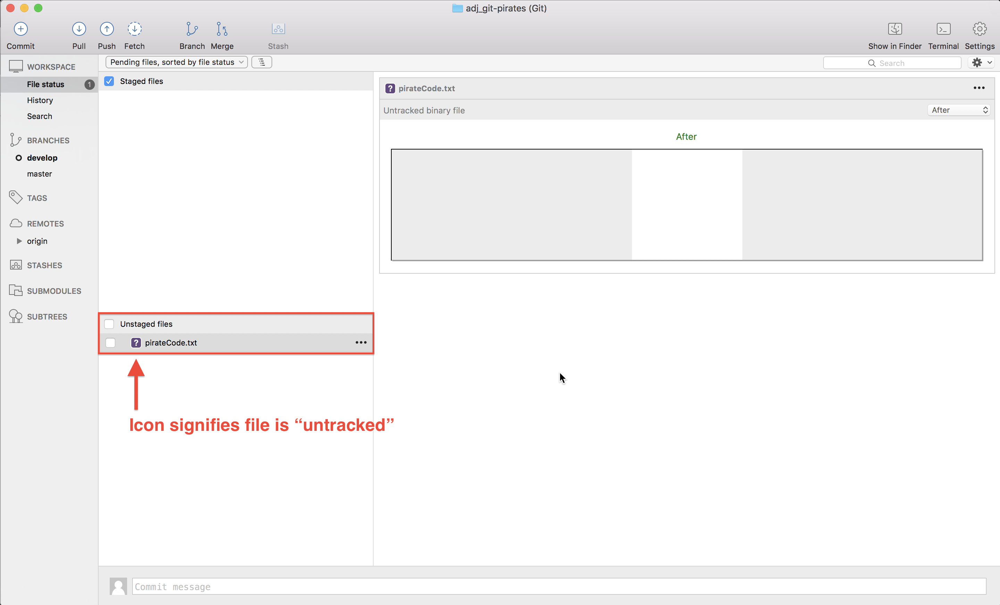

*I have added command line interface (CLI) screenshots to provide context. You won't see these if using SourceTree, but they can help understand what's happening when using the SourceTree GUI (graphical user interface). The screenshots of the CLI will always match the state of the previous SourceTree screenshot.*

By checking the `git status` in the CLI, we see our untracked, unstaged file.
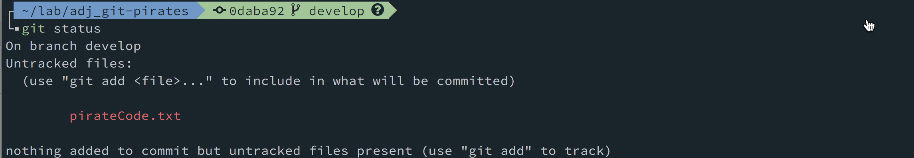

### **2) ACTION: Add file to staging** 

We will now add the file to the Git `index`. This is also sometimes called the `staging` area. Don't be confused--the `index` and `staging` area are the same thing. Additionally, "adding a file to the `index`" and "staging a file" are exactly the same thing. Both signify to Git: 

>I want these particular files that are currently in my working tree (or file directory as we discussed above) to be included in the next snapshot (or commit) for version control. 

Here again, terminology is often confusing. Git calls a `snapshot` a `commit`. You are committing files to the Git database and thus creating a snapshot of your filesystem at a point and time. A `commit` and a `snapshot` are completely synonymous here.
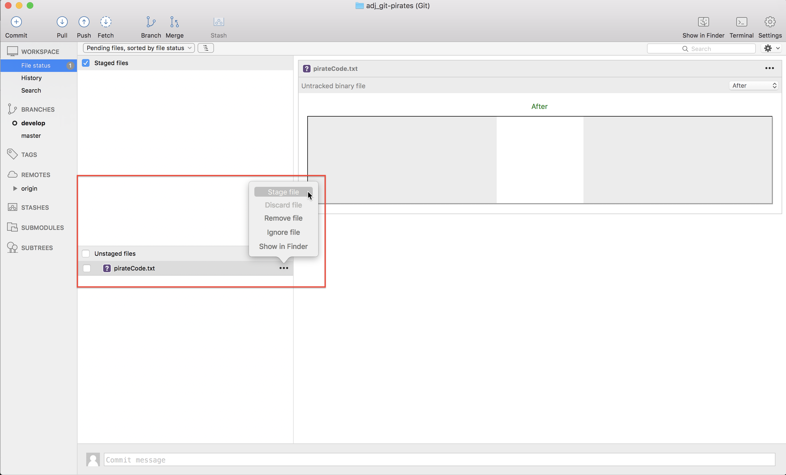

The CLI "adds" the file to the index -- this is the same as SourceTree staging the file.
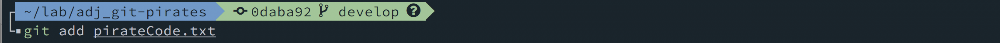

After staging the file, we now see it in the staging area with a `+` icon
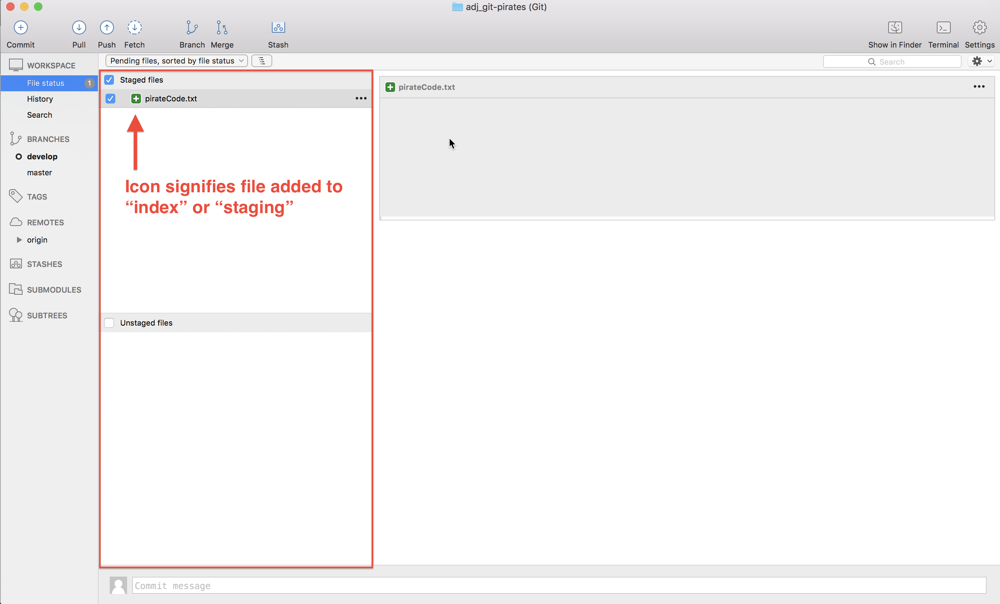

Similarly on the CLI it is shown as a "new file" under "Changes to be committed"
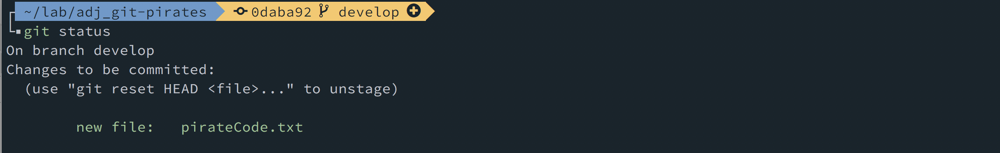

### **3) ACTION: Unstage file** 
We can also move right back to our previous state by "unstaging" the file or "removing it from the index"
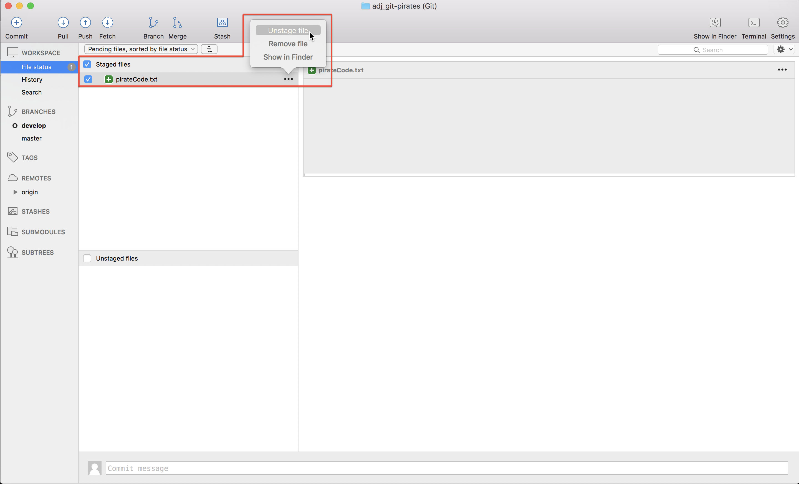

The CLI uses `reset` (poor word choice in my opinion) to unstage the file.
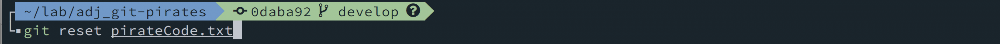

We are now back in our previous position with an unstaged, untracked file in our repository.


### **4 & 5) ACTION: Add file to staging & commit file**

Go ahead and stage the file again. This time add a `commit message`. The purpose of the commit message is to document changes that are being made to the snapshot--the commit message will be associated with the state of the files listed in the staging area at that particular time. Your commit message can say whatever you like for the moment--we'll discuss writing commit messages shortly.
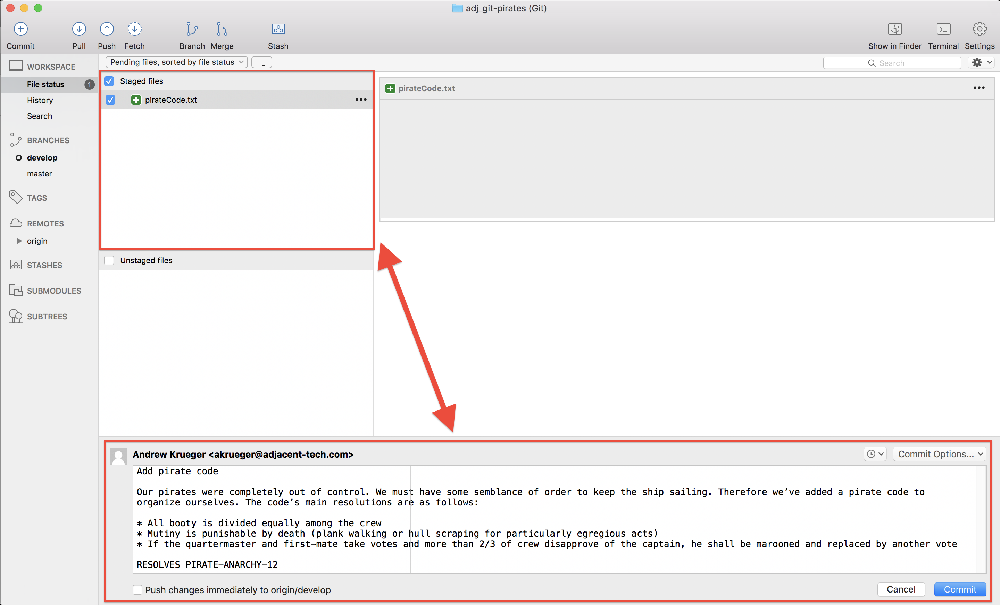

The CLI will open whatever editor you have configured to Git for manipulating commit messages.
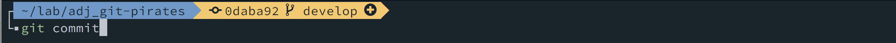
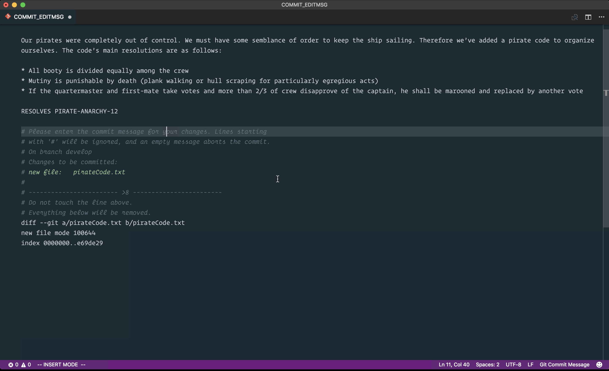

Once we have successfully submitted our snapshot by committing it, we can look in the "History" workspace and see our newly added snapshot/commit as well as a log of all committed snapshots in the repository.
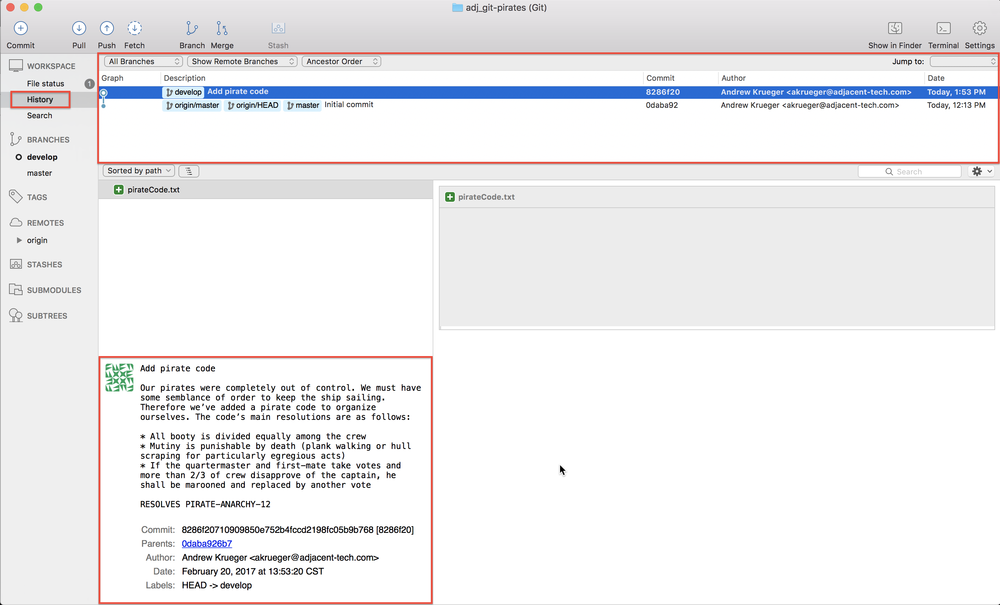

The CLI will confirm the committed snapshot has been recorded. Using `git log`, we can see a history of committed snapshots in this repository.
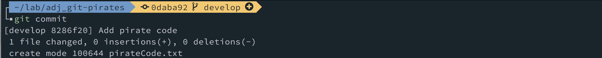
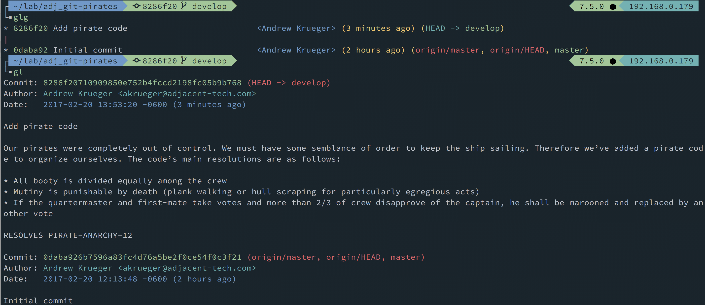

You've now committed a snapshot to your repository. You can always come back to the snapshot at any time and your working tree will look exactly like this point and time--i.e. Git will uncompress these files from its database and populate your OS filesystem with the contents calling it your working tree.

### **6) ACTION: Add text to file**

We're going to make one more small commit by adding some content to our pirate code. Hopefully letting the rowdy crew know that any future treasure we capture will be divided equally among us will help to calm their fury. Add the following text to your `pirateCode.txt`:

```
1. All booty shall be equally divided among crew.
```

Once you have saved the text to the file, we should now see that SourceTree is telling us we have uncommitted changes, a modified file, and the contents of those modifications:
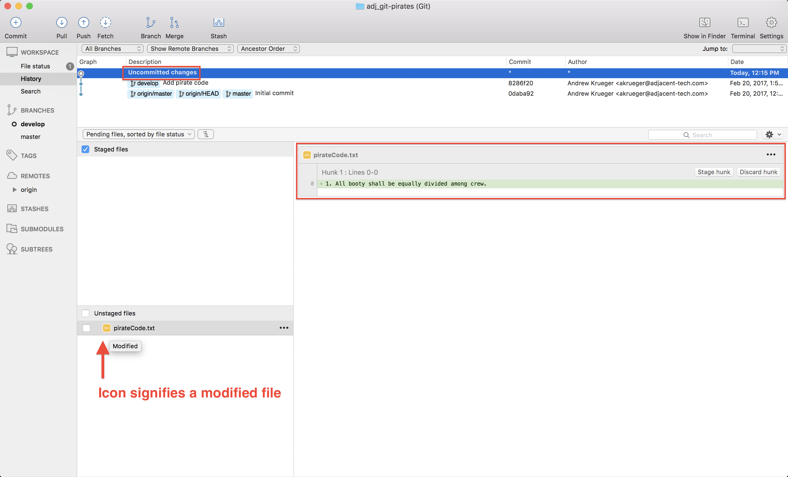

### **7 & 8) ACTION: Stage file & commit changes**

Go ahead and stage the changes, then commit the changes to a snapshot.
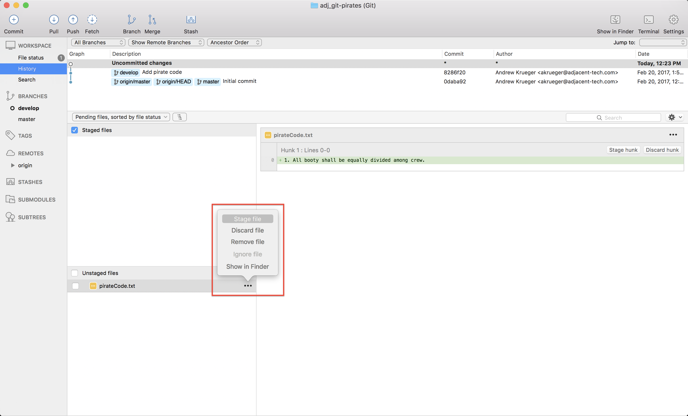

Go to the "File status" workspace to commit your change.
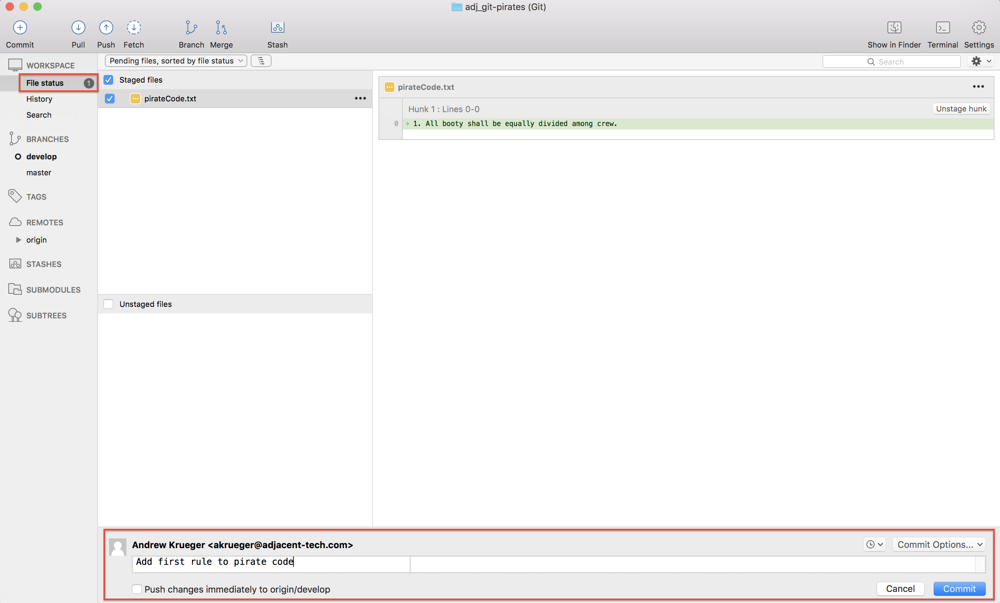

Back in the "History" workspace, you should now see your new snapshot
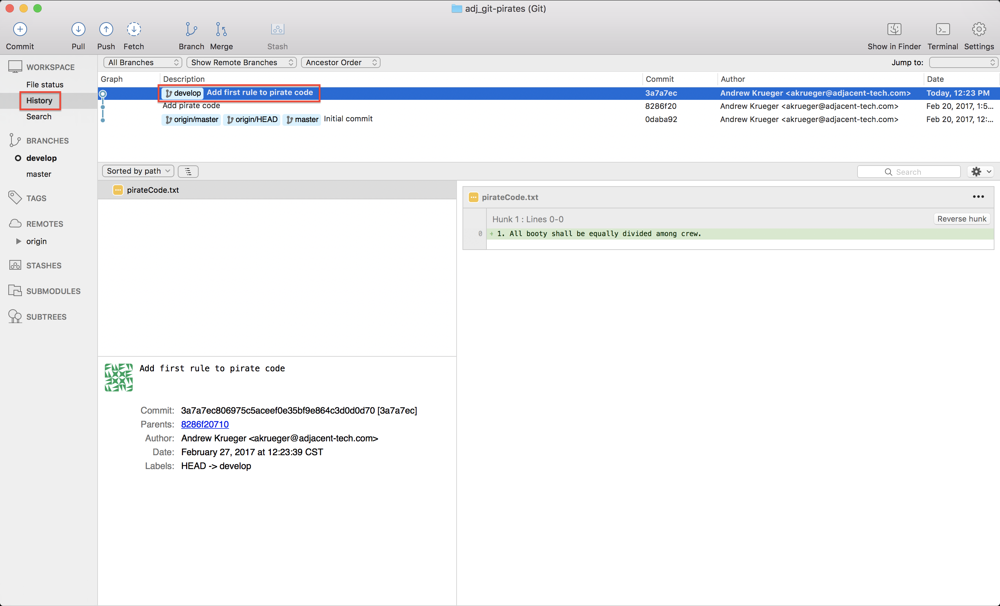

### **9) ACTION: Checkout `master` branch**

If you remember, right after we cloned this repository, we immediately switched to a new branch: `develop`. We then made a change and committed it. Let's switch back to `master` to see the differences between the two branches. For a good overview of branches, take a look at this [article](https://www.atlassian.com/git/tutorials/using-branches).

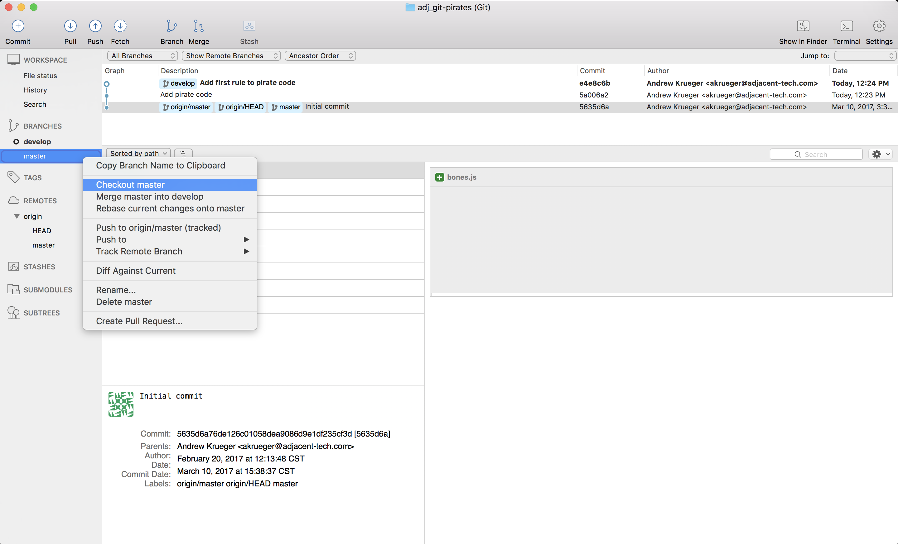
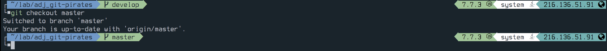

We are now on our `master` branch. If we examine our working directory we see that there is no `pirateCode.txt`. 

*Note: to view all the files in your Git directory from inside SourceTree, make sure `All files` are selected in the `File status` section.*

 **We have arrived at a critical point for understanding a core concept in Git.**

`pirateCode.txt` is **NOT** lost or deleted.

### **TAKEAWAY: moving between branches will move particular files in particular states between Git's repository database and your filesystem.**

**Note: in reality, all files are still on your filesystem, the Git database is simply stored in a hidden folder:* `.git`. *This folder resides at the root of your repository.*

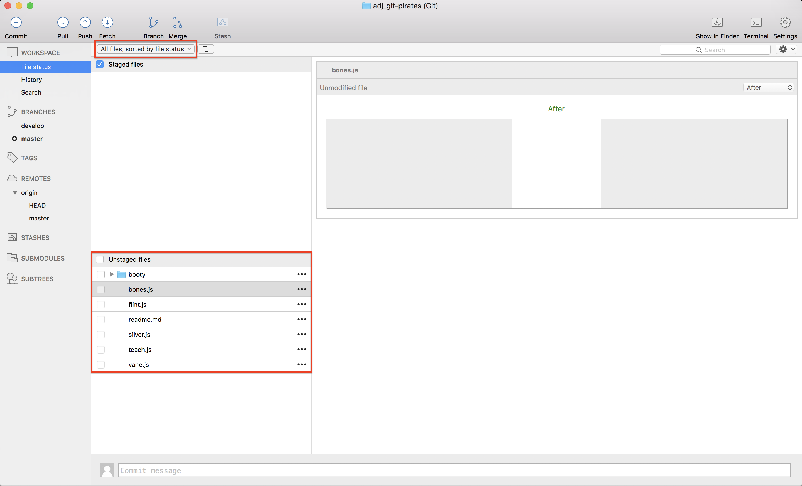
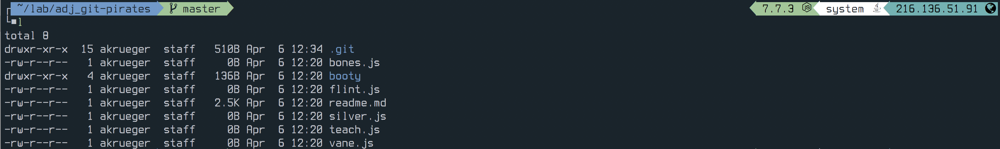

### **10) ACTION: Checkout `develop` branch**

To prove this let's now check back out the `develop` branch.

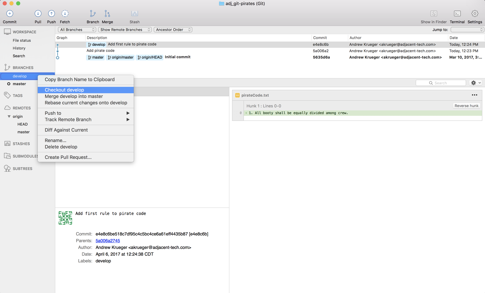
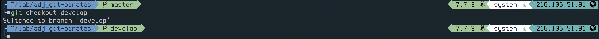

And there we are... our `pirateCode.txt` is back in our working tree and on our file system.

*Note: to view all the files in your Git directory from inside SourceTree, make sure `All files` are selected in the `File status` section.*

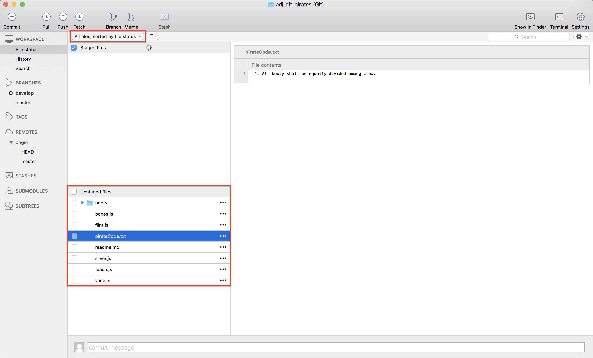
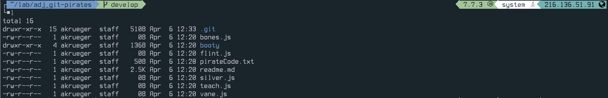

So to reiterate what Git just did:

1. We told Git we'd like to checkout a different branch
2. Git looks inside its database and compares the last commit in your current branch to the last commit on the branch you've requested. 
3. If any files are the same, it compares their state.
4. If any of the states are the same, it keeps that file in your working directory
5. For all other files--don't exist in both places or have a different state--it moves those files out of your working directory on your current branch into its database. Similarly it pulls files from its database and places them in your current working directory.

So in this case, all of our common files that had not changed just remained, but Git saw that `pirateCode.txt` did not match between `master` and `develop`; so when we switched to `master`, it placed `pirateCode.txt` back into its database so it would be ready to pull if we ever switched back to our `develop` branch.

**Understanding this process is paramount to feeling comfortable with Git.**

If you frequently find yourself day-dreaming... staring out the window pining for more Git knowledge... you may be curious how branches work under the covers. It's actually dead-simple but ruffles the conceptual model a bit. Take a look [here](https://git-scm.com/book/en/v2/Git-Branching-Branches-in-a-Nutshell).

---

## **How often should I commit?**
> *Take small bites and commit frequently*

Smaller and more frequent commits yield positive externalities for you and the rest of
the team:

* More granular commits make it easier to find and track down bugs when something breaks
* It’s easier to roll back specific changes instead of a giant changeset.
* Smaller work is focused and easier for teammates to review and integrate
* Lower process overhead for everyone with fewer merge commits

This is easier said than done and takes some practice, but it really does help. Try
your best to commit pieces of work in as small a chunk as possible. It may seem tedious
at first, but the above advantages pay off big down the road.

 **You don't have to stage & commit files all at once. Even if you've made five different modifications, you can stage and commit those one at a time to have a more granular commit history--it's not necessary commit all of your modifications together.**

My commits aren't perfect and we'll see ways to improve them in just a little while, but
as a frame of reference, this is my git log on a recent project. You can see quite a few
commits each day with small subject titles for each of the changes represented in a
commit. If all of these little changes were lumped in with a large commit of app logic,
chasing down a bug in that app logic becomes a slog because we have to sift through
mundane file modifications. When they are separated, we can laser in on what we're
looking for in our source code.

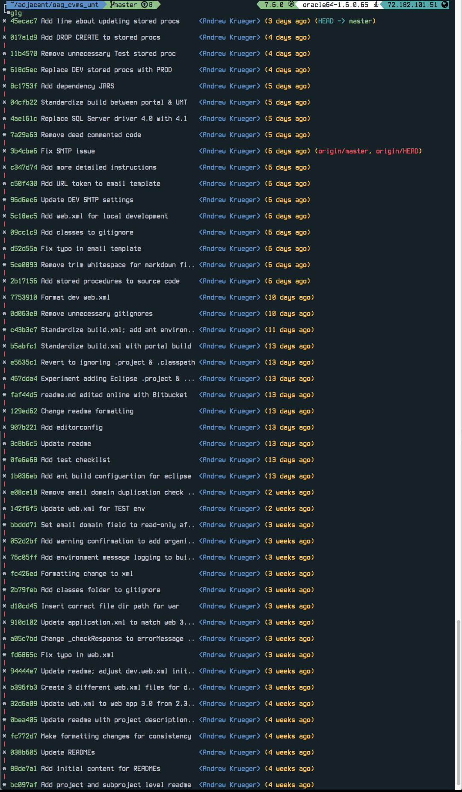

That's a good segue into...

## **Writing great Git commit messages**


## **The seven rules of a great Git commit message:**
---
### 1. Separate subject from body with a blank line
### 2. Limit the subject line to 50 characters
### 3. Capitalize the subject line
### 4. Do not end the subject line with a period
### 5. Use the imperative mood in the subject line
### ~~6. Wrap the body at 72 characters~~ `OPTIONAL`
### 7. Use the body to explain what and why vs. how


#### These rules come from Chris Beams' [excellent post](http://chris.beams.io/posts/git-commit/) on Git commit messages. I highly encourage giving it a read as it will give these rules context and purpose.
---

### Here's an example of a commit message that satisfies six of the seven rules:
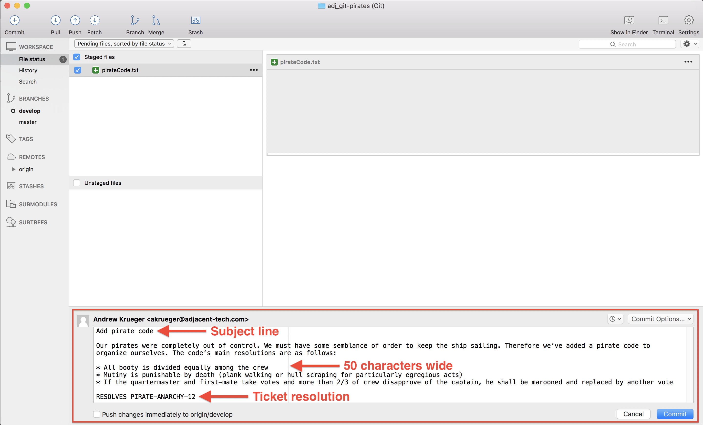

### After we commit, we receive a nice abridged description of the commit (the subject line) in our log. If we highlight a particular commit, we can see the full details of the commit.


### However, sometimes a concise subject line is a perfectly appropriate commit message. There's no hard rule--when it comes time to write your messages, try to mimic the style of commit messages you've found helpful when reading logs.


### As with SourceTree, all the other places commit messages show up benefit from descriptive and readable commits messages:
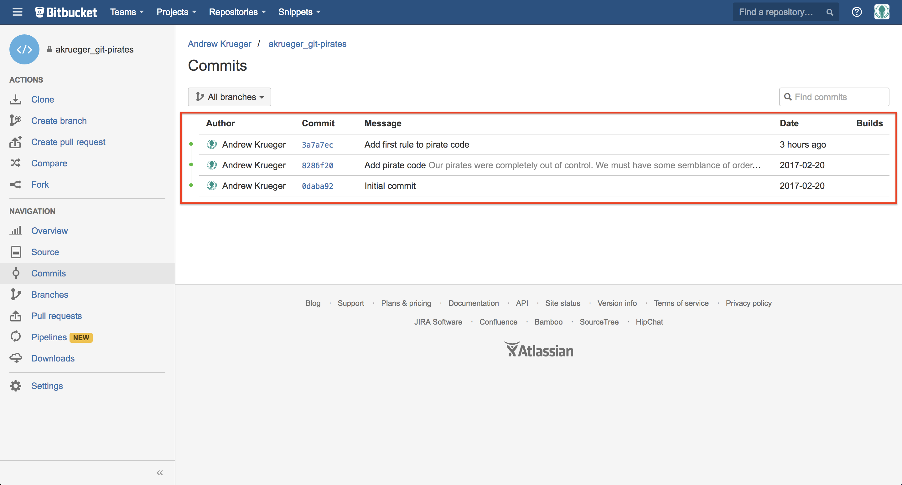
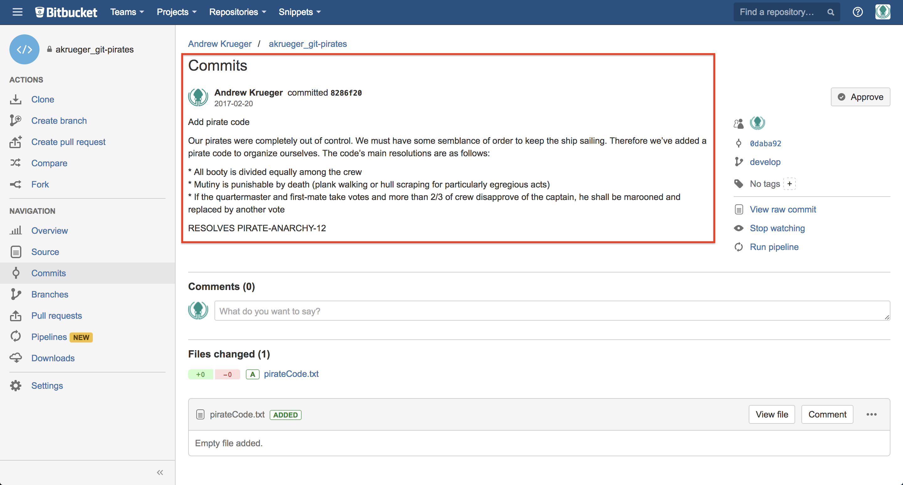
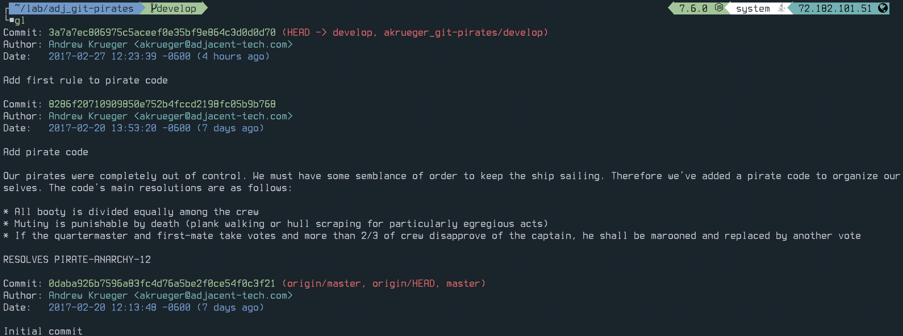

### In SourceTree, under the general options/preferences, check the options for fixed-width font and a column guide display at 50 characters for commit subject lines. This will help make commit messages more readable and uniform for everyone.
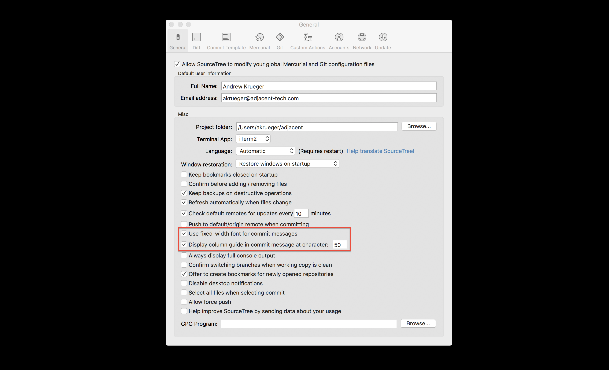

## **Interlude**

Now that we've gotten our hands a little bit dirty in Git, we're going to step back and add a bit more high level context to what we've been doing. This interlude will be a deep-dive. Don't worry if it doesn't make sense the first time. You can come back to it. 

## **Version Control Paradigms:**

### **TAKEAWAY:** GIT IS A DISTRIBUTED VERSION CONTROL SYSTEM.

**Recommended reading:**  
A more detailed, but short overview of the different [types of version control systems](https://git-scm.com/book/en/v2/Getting-Started-About-Version-Control).

There are three commonly used paradigms of version control systems:  

* **Local** (naming a word doc `document_v1.docx`, `document_v2.docx`, etc)
* **Centralized**  (Subversion, Team Foundation Version Control)
* **Distributed** (Git, Mercurial)

### **LOCAL:**  
You *are* the version control database; only you have a copy of everything  

  

---

### **CENTRALIZED:**  
The version control database is a remote server; you check out particular files from it check files back in once you've modified them. Files are often locked when checked out so that more than one person cannot work on the same file at the same time.  

  

---

### **DISTRIBUTED:**  
Everyone is the version control database. Everyone has a copy of everything. Anyone can work on anything at the same time -- this is Git  

  

### OneDrive, Dropbox, Google Drive, Box, etc
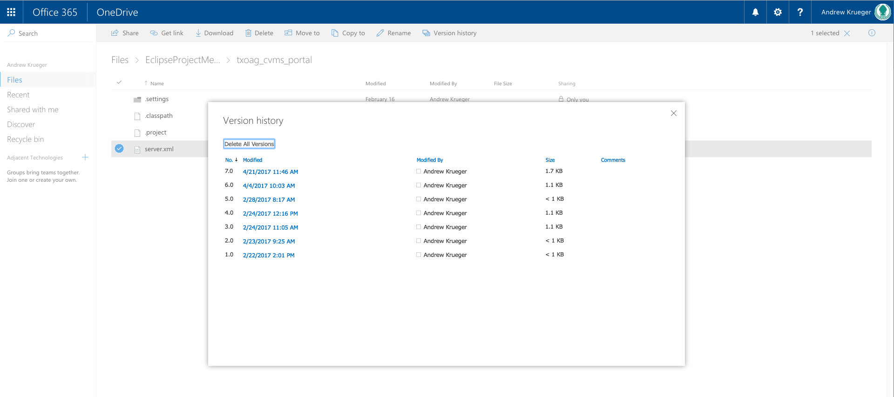

---

## **Challenges of Git:**

### **TAKEAWAY:** GIT HAS A STEEP LEARNING CURVE, BUT IT IS AN EXTREMELY POWERFUL SOURCE CONTROL MANAGEMENT SYSTEM AND DEVELOPMENT TOOL.

#### Git is hard. 

Git was designed by Linux kernal contributors. They didn't (and still don't often) have the masses in mind when considering usability or barriers to entry. 

> One common criticism of Git is that it can be difficult to learn. Some of the terminology in Git will be novel to newcomers and for users of other systems, the Git terminology may be different, for example, `revert` in Git has a different meaning than in SVN or CVS. Nevertheless, Git is very capable and provides a lot of power to its users. Learning to use that power can take some time, however once it has been learned, that power can be used by the team to increase their development speed.

> Source: [What is Git?](https://www.atlassian.com/git/tutorials/what-is-git)

Some challenges of Git:  

* Complex information model  
* Closer to bare metal -- fewer abstractions in the user interface   
* Inconsistent/ambiguous command line syntax  

### **Advantages:**

With the exception of inconsistent/ambiguous command line syntax, these barriers to entry have positive tradeoffs as well. Git is the most expressive, flexible, and performant source control system in wide-use. It is every bit as much a development tool as source control system. I use Git for personal projects where I am the only contributor. If I didn't have internet access, I would still use Git. It helps craft and organize content that much.

Some benefits of Git:  

* Free  
* Mature, actively maintained open source project  
* By far, the most widely used modern version control system in the world  
* Blazing fast  
* Distributed architecture -- data is always available to all users  
* Data integrity -- hashing  

### **It is almost impossible to lose data in Git.**

#### If you don't know enough Git to be sure you fully removed something from Git, you probably didn't. 
[](https://asciinema.org/a/59xgcggho2vsfi8f68ed5c0ez)

---

## **Git ≠ Bitbucket**

**Git**: version control system  
**Bitbucket**: source control hosting platform

Bitbucket hosts Git and Mercurial content on their servers. In some cases they provide additional services on top of the hosted content.

* Bitbucket requires Git (or Mercurial)  
* Git does not require Bitbucket

--- 

## **The Three States:**

### **TAKEAWAY:** GIT HAS THREE MAIN STATES THAT YOUR FILES CAN RESIDE IN: `COMMITTED`, `MODIFIED`, AND `STAGED`.

Think of Git as the pirate captain--Captain Git--of a particular directory (a repository) in your OS's filesystem. When you place a Git repository inside a directory, it tells the OS's filesystem:

> I'm going to be steering this ship you landlubber OS. Sit down. Eat this cookie. I'll decide what the contents of this directory are.  

It will then compress and uncompress sets of files (trees of file structures) according to your instructions. All the data lives compressed in the Git database (located at `./.git`), but it will only show you one uncompressed snapshot at a time in the actual filesystem.  

Git has three main states that your files can reside in: `committed`, `modified`, and `staged`. Committed means that the data is safely stored in your local database. Modified means that you have changed the file but have not committed it to your database yet. Staged means that you have marked a modified file in its current version to go into your next commit snapshot.

* **COMMITTED:** The `.git` directory is where Git stores the metadata and object database for your project. This is the most important part of Git, and it is what is copied when you clone a repository from another computer.

* **MODIFIED:** The working tree is a single checkout of one version of the project. These files are pulled out of the compressed database in the Git directory and placed on disk for you to use or modify.
* **STAGED:** The staging area is a file, generally contained in your Git directory, that stores information about what will go into your next commit. It’s sometimes referred to as the “index”, but it’s also common to refer to it as the staging area.

##### The basic Git workflow goes something like this:

1. You modify files in your working tree.
2. You stage the files, adding snapshots of them to your staging area.
3. You do a commit, which takes the files as they are in the staging area and stores that snapshot permanently to your Git repository.

This is exactly what we did above with our pirate code.

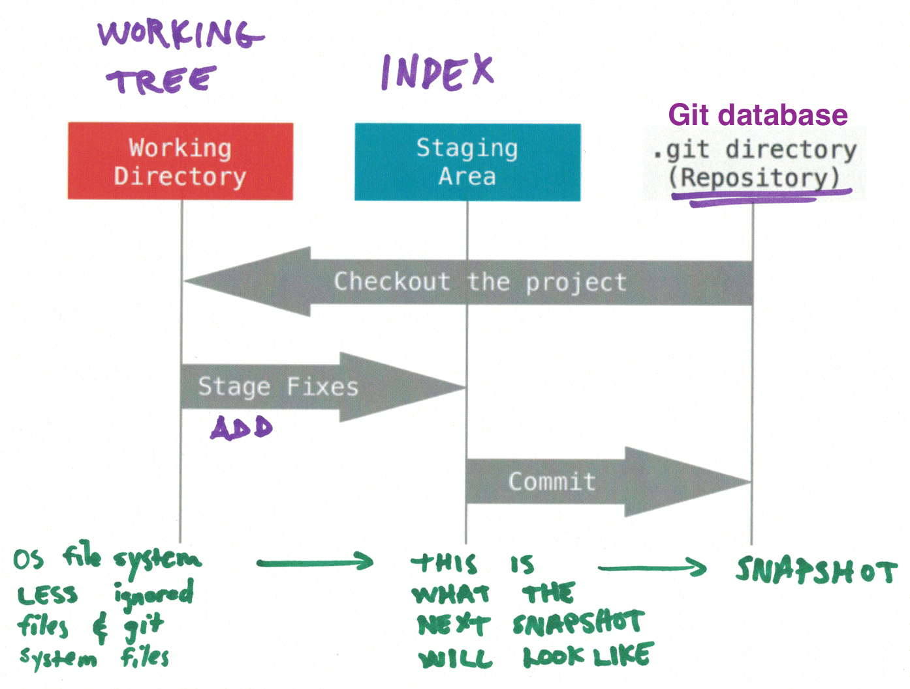

## **File Lifecycle:**

### **TAKEAWAY:** AS YOU EDIT FILES, GIT SEES THEM AS MODIFIED, BECAUSE YOU’VE CHANGED THEM SINCE YOUR LAST COMMIT. YOU STAGE THESE MODIFIED FILES AND THEN COMMIT ALL YOUR STAGED CHANGES, AND THE CYCLE REPEATS.

You have a bona fide Git repository and a checkout or working tree of the files for that project. You need to make some changes and commit snapshots of those changes into your repository each time the project reaches a state you want to record.

Remember that each file in your working tree can be in one of two states: `tracked` or `untracked`. Tracked files are files that were in the last snapshot or have just been staged; they can be unmodified (`committed`), `modified`, or `staged`. Untracked files are everything else – any files in your working tree that were not in your last snapshot and are not in your staging area. When you first clone a repository, all of your files will be tracked and unmodified because Git just checked them out and you haven’t edited anything.

As you edit files, Git sees them as modified, because you’ve changed them since your last commit. You stage these modified files and then commit all your staged changes, and the cycle repeats.

Untracked basically means that Git sees a file you didn’t have in the previous snapshot (commit) and you haven't added it to the index/staged it. *All* files start their lifecycle as untracked when they are added to the repository for the very first time.

In the diagram below, a file starts its lifecycle untracked. The only state change this file can effect according to Git is to be staged (if it were altered, it wouldn't be noticed by Git because it is untracked). 

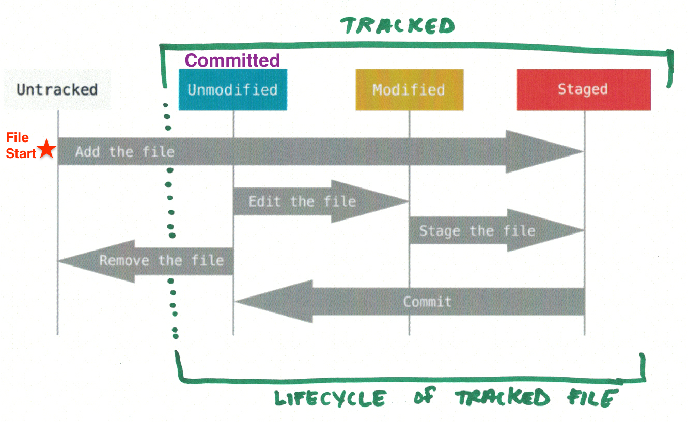  

---

## **Recap:**

* ### Git has a steeper learning curve than most source control systems
* ### As a source control system, Git provides value by backing up and sharing code with others in a distributed paradigm, but it is also a powerful development tool in its own right
* ### The primary building blocks of Git are repositories that hold snapshots of your file system (commits) at different points in time
* ### Commit often  
* ### You don't have to stage & commit all currently modified files at once.  You may retroactively commit them in appropriate chunks.
* ### Write good commit messages--it will benefit you and your team
* ### It's almost impossible to lose content permanently in Git
* ### Git ≠ Bitbucket
* ### A file in Git is always in one of three states: `committed`, `modified`, or `staged`
* ### If a file is in one of these three states, Git considers it a `tracked` file and will pay attention to it.  

## **Next: [Remotes](https://bitbucket.org/adjacentdev/adj_git-pirates/wiki/Remotes)**  

## **[Home](https://bitbucket.org/adjacentdev/adj_git-pirates/wiki/Home)**