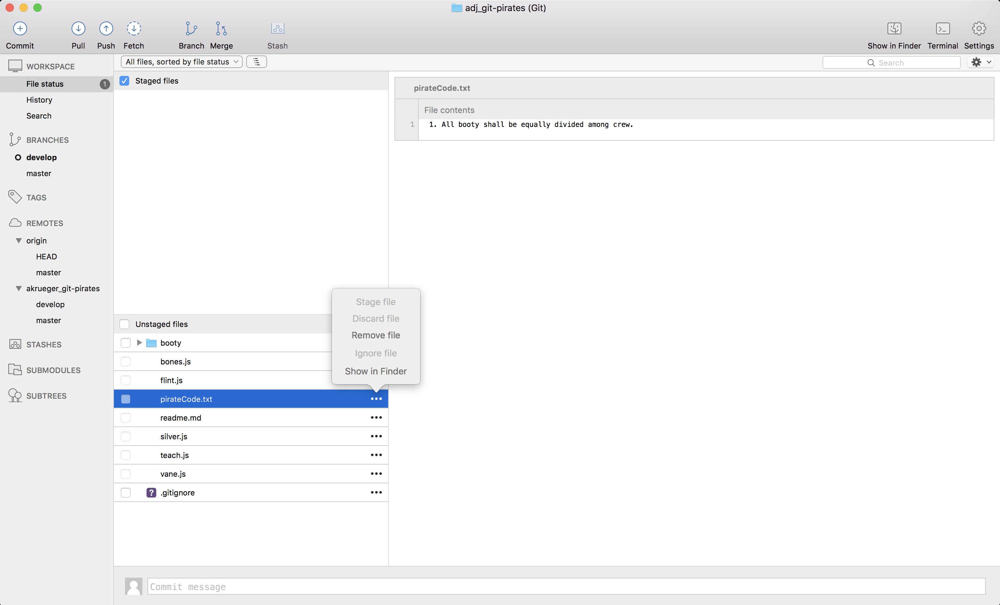

# Ignores

### **Setting**
> Dastardly dog doubloons! Your launch has been captured near Barbados by a British brig patrolling the Lesser Antilles. On a positive note the launch you set out towards land has brought back a veritable cornucopia of nourishment from a nearby island. These events and their consequences, if deftly handled, could work out well for you...

> Now that the crew has full bellies, the flames of the looming mutiny are all but extinguished. With singular power back in hand, it would be quite nice to not have to share all the future prizes equally among crew. Additionally, now that the British Royal Navy have proof of your piracy--thanks to the damning document that you made effort to sign with great flourish and aptly titled: **_Pirate_ Code**...

>

> --you'd be prudent to cache any further implication of your less than honorable deeds. 

> You are also reminded that the chest of gold that you conveniently relieved from a Spanish Galleon a week past sits in your hold--its key hanging from your neck. If you are captured, or the Medusa is boarded by the Royal Navy, you're unlikely to ever see the treasure again--there's also a strong chance crows will be picking at your eyes from the inside of a gibbet by next landfall. If only we could hide the pirate code and divest the treasure key from our person to keep prying eyes away from both...

### **ACTIONS** agenda:

1. [Create `key.txt` file](#markdown-header-1-action-create-keytxt-file)
2. [Ignore key file from repository](#markdown-header-2-action-ignore-key-file-from-repository)
3. [Attempt to ignore Pirate Code file from repository](#markdown-header-3-action-attempt-to-ignore-pirate-code-file-from-repository)
4. [Stop tracking Pirate Code file by removing it from index](#markdown-header-4-action-stop-tracking-pirate-code-file-by-removing-it-from-index)
5. [Ignore Pirate Code file from repository](#markdown-header-5-action-ignore-pirate-code-file-from-repository)
6. [Commit ignores](#markdown-header-6-action-commit-ignores)

*When you see the **ACTION** prompt, it means you need to do something to progress in the exercise.*

## Stow away the treasure key

#### We want to take this blasted key off, so let's create a `key.txt` file to store it. We'll put it in the `booty` directory along with `map.pdf` and `treasure.json`. 

#### Repository directory contents:

### **1) ACTION: Create `key.txt` file** 

#### Repository directory contents:

#### We see our untracked, unstaged key file in our working directory

### **2) ACTION: Ignore key file from repository** 
#### In order to keep the key file local to us and prohibit Git from sharing the key file with anyone else we colloborate with, we must add it to our `gitignore` file.

> A `gitignore` file specifies intentionally untracked files that Git should ignore. **Files already tracked by Git are not affected.** 

 Remember this last point. It will be important in our next steps.

#### Right click the `key.txt` file and select "Ignore file"

#### Select "This repository only" 
**Note: we will discuss the difference between local and global ignores at the end of the module*

#### The `key.txt` file is now being ignored from our repository

#### `key.txt` is still present in our file system, but it is not being tracked by Git and will not go into our next commit--therefore it will not be shared with anyone else we are collaborating with.

#### From the CLI:

## Hide the Pirate Code

### **3) ACTION: Attempt to ignore Pirate Code file from repository** 
#### Interestingly when we add `pirateCode.txt` to our `gitignore`, it is not successfully ignored. This is because `pirateCode.txt` is currently being tracked by Git. A file is tracked once it has been added to the index/staged.

#### SourceTree keeps you honest by greying out the "Ignore file" option because it knows that `pirateCode.txt` is a tracked file. Hence, it order to ignore it, it has to cease being tracked before it can be ignored.

### **4) ACTION: Stop tracking Pirate Code file by removing it from index** 

#### Click on the file and select "Stop Tracking"

### **5) ACTION: Ignore Pirate Code file from repository** 

#### Now our "Ignore file" option opens up and we can successfully ignore the file. Note that `pirateCode.txt` is considered deleted/removed in the staging area.

#### Select "This repository only" 

#### Success! `pirateCode.txt` is now being ignored by Git

#### Note that the file is not deleted from our file system, it is only "removed" or "deleted" from Git's point of view.

#### As you can see from this example, it's more straightforward to ignore a file _before_ adding it to the index or committing it--though it's certainly possible to do so afterwards.

### **6) ACTION: Commit ignores** 

* Stage **_all_** changed files in your local repository
* Commit staged changes
* Push those commits to your individual remote repository we recently created (**not origin**)

---

## **Recap:**

* ### A `gitignore` file specifies intentionally `untracked` files that Git should ignore. *Files already `tracked` by Git are not affected.*
* ### A `tracked` file may not be ignored (see commits section of Wiki for `tracked` vs `untracked` files)
* ### Ignored files still exist on the file system

Keep in mind the separation of Git entities as we went through this process:

* **Git directory** -- location on your file system where the `.git` directory resides; responsible for populating the files into the Git directory based on what commit you currently have checked out

* **Git working tree** -- the file tree from a specific commit that you currently have checked out

* **Git index** (also called staging) -- a file that lists information about what will go into your next commit

## Global gitignore vs local gitignore
**Global gitignore**: every single Git repository on a local machine is filtered through the global gitignore. It is specific to your local environment. The global gitignore location is set in the global `gitconfig`--the configuration file for all Git repositories on your local machine.

**Local gitignore**: specific to the particular Git repository it resides in. These can be nested inside directories of the Git repository.

#### **Note: all gitignores stack and are cumlative*

---

## Adjacent has a global gitignore located at the following repository. Go there and follow the instructions to activate the global gitignore on your machine.
## [Adjacent global gitignore repository](https://bitbucket.org/adjacentdev/adj_global-gitignore)

---

## **Next: [Merging](https://bitbucket.org/adjacentdev/adj_git-pirates/wiki/Merging)**  

## **[Home](https://bitbucket.org/adjacentdev/adj_git-pirates/wiki/Home)**