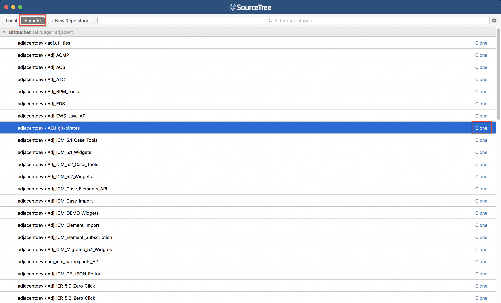
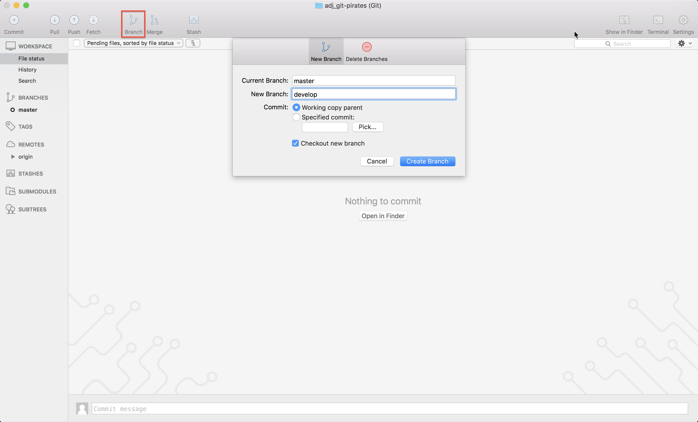
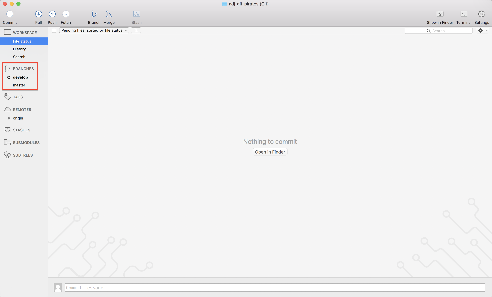

# Introduction

To begin we're going to copy this Git repository to our local hard drive from where 
it currently lives as a `remote repository` on <strike>Bitbucket's servers (Bitbucket Cloud)</strike>
Github.

From now on we'll refer to a `remote repository` as any repository located away from our local machine and a `local repository` as our local machine.

## Instructions:
`Clone` (copy) this repository to your local machine:

**From the CLI:**  
`git clone https://github.com/jknight/git-pirates git-pirates`

**From SourceTree:**  

You will start on the `master` branch--the same branch that you cloned from the 
remote repository on git. We're going to make some changes, so let's check out 
a fresh branch named `develop` to make it easier to work with the changes. 

A good place to start your understanding of branches is an overview found 
[here](https://www.atlassian.com/git/tutorials/using-branches). 
It's not critical to understand branches at this point and we're going to come 
back to them later, so you may skip these for now if you'd like to keep moving.

**From the CLI:**  
`git checkout -b develop`

**From SourceTree:**  
  

You should now be on the `develop` branch.

## **Next: [Commits](Commits.md)**  

## **[Home](https://github.com/jknight/git-pirates)**
