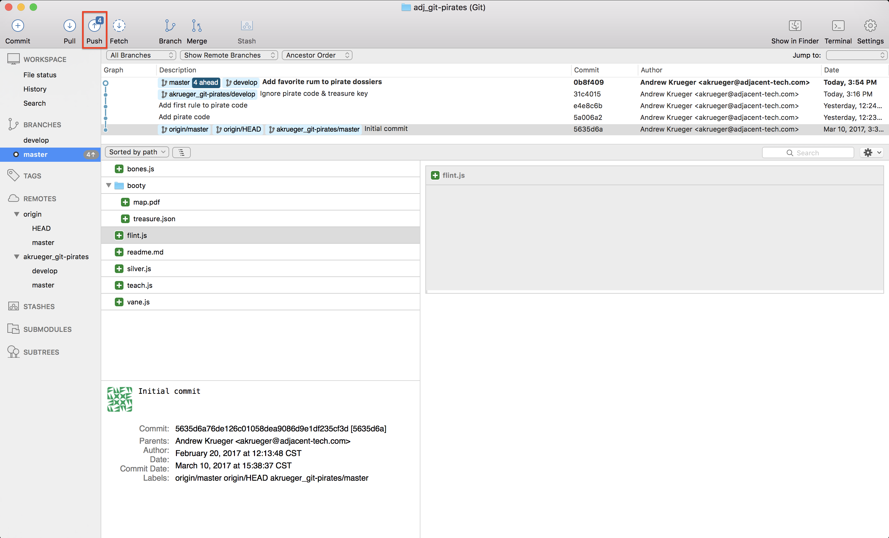
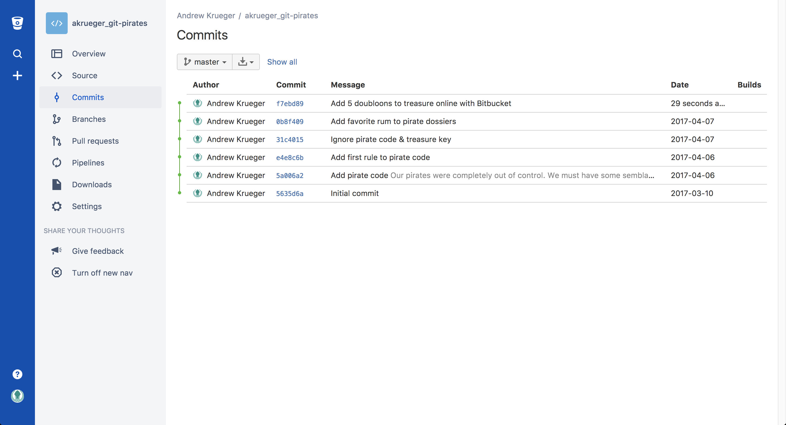
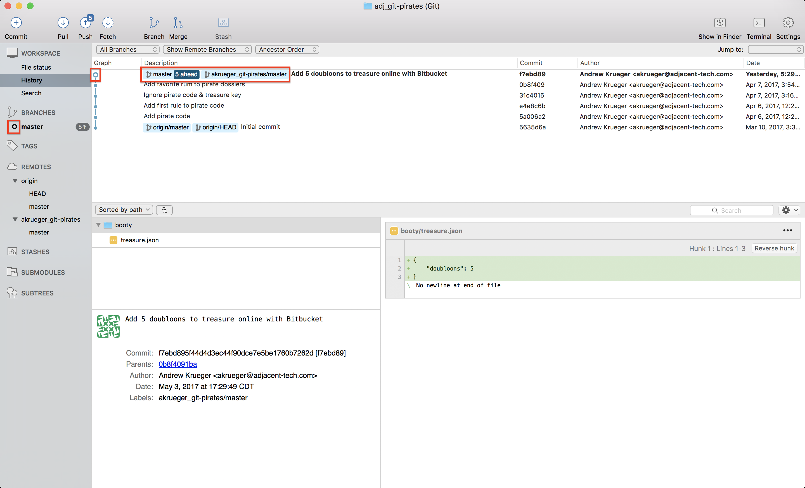
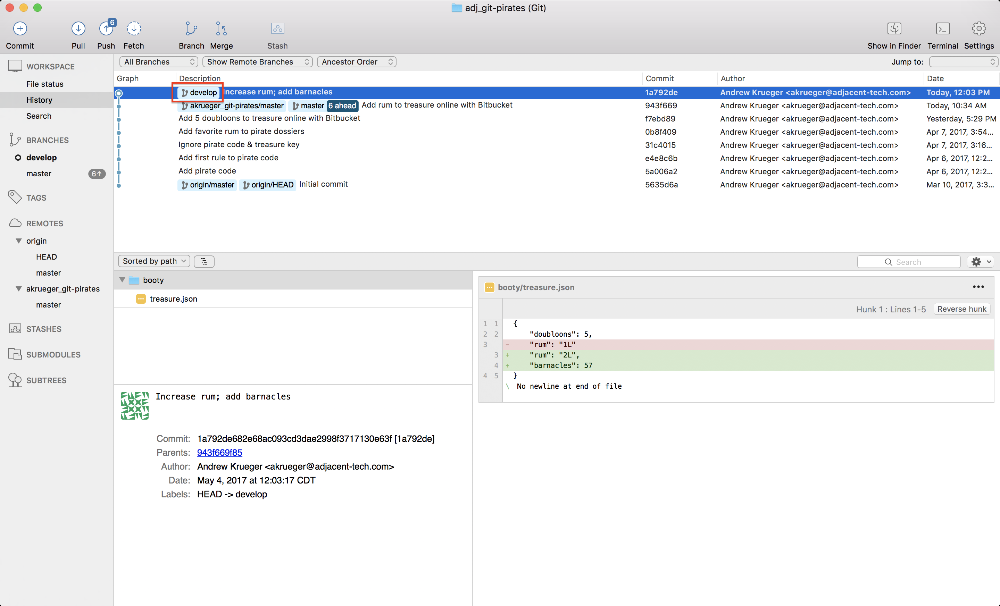
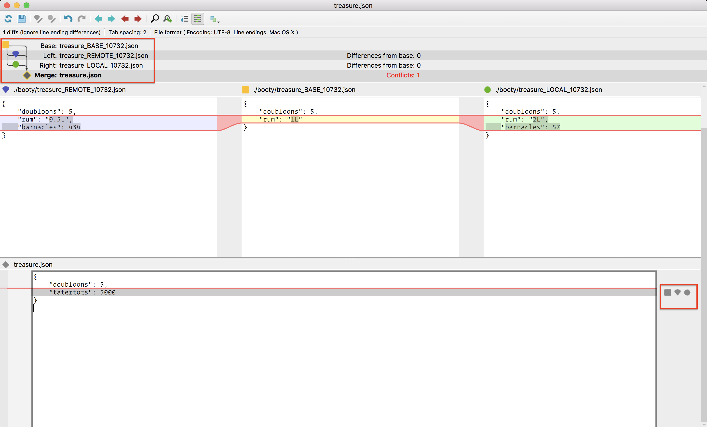

# Merging

### **Setting**
> Amazing luck! The Apis has been spotted. It must have been dispatched to the Medusa's last known position after you failed to arrive in port as scheduled. The Apis is your flagship vessel--an 80 gun Man-of-War that weakens the knees of even the most intrepid of Royal Navy captains. It's time to vacate the Medusa, leaving it with a skeleton crew, and move over to the Apis. We'll of course transfer all the important cargo we had onboard the Medusa such as the treasure chest as well as important documents.

### **ACTIONS** agenda:

1. [Add content to pirate dossiers](#markdown-header-1-action-add-content-to-pirate-dossiers-&-commit-changes)
2. [Check the diff to see what is different between our `master` branch and `develop` branch](#markdown-header-2-action-check-the-diff-to-see-what-is-different-between-our-master-branch-and-develop-branch)
3. [Merge the `develop` branch into the `master` branch](#markdown-header-3-action-merge-the-develop-branch-into-the-master-branch)
4. [Push `master` branch to our remote](#markdown-header-4-action-push-master-branch-to-our-remote)
5. [Clean up merged branches](#markdown-header-5-action-clean-up-merged-branches)
6. [Delete remote branch](#markdown-header-6-action-delete-remote-branch)
7. [Fetch data from remote repository](#markdown-header-7-action-edit-treasurejson-on-bitbucket)
8. [Commit changes to `treasure.json`](#markdown-header-8-action-commit-changes-to-treasurejson)
9. [Add commit message](#markdown-header-9-action-add-commit-message)
10. [Fetch data from remote repository](#markdown-header-10-action-fetch-data-from-remote-repository)
11. [Merge remote `master` changes into local `master`](#markdown-header-11-action-merge-remote-master-changes-into-local-master)
12. [Edit `treasure.json` on Bitbucket](#markdown-header-12-action-edit-treasurejson-on-bitbucket)
13. [Pull from `master` on the remote repository](#markdown-header-13-action-pull-from-master-on-the-remote-repository)
14. [Create `develop` branch & edit local `treasure.json`](#markdown-header-14-action-create-develop-branch-edit-local-treasurejson)
15. [Stage and commit changes](#markdown-header-15-action-stage-and-commit-changes)
16. [Merge local `develop` branch into local `master` branch](#markdown-header-16-action-merge-local-develop-branch-into-local-master-branch)
17. [Clean up branches](#markdown-header-17-action-clean-up-branches)
18. [Make conflicting edits to `treasure.json` on Bitbucket](#markdown-header-18-action-make-conflicting-edits-to-treasurejson-on-bitbucket)
19. [Add commit message](#markdown-header-19-action-add-commit-message)
20. [Push `master` branch to remote](#markdown-header-20-action-push-master-branch-to-remote)
21. [Pull remote `master` into local `master`](#markdown-header-21-action-pull-remote-master-into-local-master)
22. [Use a mergetool](#markdown-header-22-action-use-a-mergetool)
23. [Save the file](#markdown-header-23-action-save-the-file)
24. [Stage & commit resolved merge conflict changes](#markdown-header-24-action-stage-commit-resolved-merge-conflict-changes)
25. [Push `master` branch to remote](#markdown-header-25-action-push-master-branch-to-remote)

*When you see the **ACTION** prompt, it means you need to do something to progress in the exercise.*

### **1) ACTION: Add content to pirate dossiers & commit changes** 
#### Add some content to each of the pirate files in our Git repository:
```
bones.js
flint.js
silver.js
teach.js
vane.js
```

You may add whatever content you like, here we're including the preferred rum of each of the pirates. We gained that knowledge when incentivizing them to come over to the Apis with us.


#### Stage and commit your changes to the `develop` branch

### **2) ACTION: Check the diff to see what is different between our `master` branch and `develop` branch** 
#### Right click on the `master` branch and select `Diff Against Current` (with current being the current branch: `develop`)


#### We can see that each of our pirate dossiers have been updated and our gitignore has been added--notable absenses are our `pirateCode.txt` and `key.txt` which we ignored. The file content changes, if applicable, are displayed in the right pane.

### **3) ACTION: Merge the `develop` branch into the `master` branch** 
#### If we think of the Medusa ship as the `develop` branch and the Apis as the `master` branch, we want to transfer everything from the Medusa over to the Apis.

#### Switch to the `master` branch. When we merge branches, we need to have our current branch be the branch we want to merge changes *into*. Since we want to merge `develop` into `master`, we need to have our current branch be `master`. 


#### Note the two branch graphs and how the merge is going to affect them. In the background we can see the two branches diverging from their common ancestor. On the merge pop-up, we see how they will be resolved into one branch (`master`). This is called a **fast-forward** merge:

> *A fast-forward merge can occur when there is a linear path from the current branch tip to the target branch. Instead of “actually” merging the branches, all Git has to do to integrate the histories is move (i.e., “fast forward”) the current branch tip up to the target branch tip.*

#### Essentially, whenever the commit that is the tip of the target merge branch is the common ancestor between the source and target merge branches, a fast-forward merge will be executed.

This can be overridden by checking the `Create a commit even if merge resolved via fast-forward` option. This will create a separate merge commit and preserve the two divergent branches in history. This will happen automatically if the target branch has advanced from the common ancestor where the two branches split (considered a 3-way merge). However, using `no-fast-forward option` behavior is sometimes desirable when one wants to keep the divergent history for a piece of work even when a fast-forard is possible.

#### Don't worry too much about `fast-forward` vs `no-fast-forward` merges. In most cases a standard Git merge will automatically do what you want. Using `no-fast-forward` is simply a matter of preference in most cases.


#### Once we complete the merge, we see the history graph updated to our single branch and SourceTree indicates in several places that our `master` branch is `4 ahead` or `4⇧`. This is in reference to the local `master` branch's `tracked remote branch`. Local branches can track remote branches so that Git can report back to you their statuses relative to each other. We can see what remote branches our local branches are set to track by right-clicking the local branch and navigating to `Track Remote Branch`.

Our local `master` branch is set to track the `origin/master` branch that we first cloned from. Because that repository only has the initial commit, Git is letting us know that we have 4 commit snapshots since that initial commit. If we pushed our current branch to `origin/master`, it would sync them and move `origin/master` to the tip of our current local `master` branch. We aren't going to do that however. We're going to push to the personal remote repository we created and have been pushing our `develop` branch to.

### **4) ACTION: Push `master` branch to our remote** 




### **5) ACTION: Clean up merged branches** 
#### Now that we have merged our changes and pushed them to remote repositories, we can clean up the branches we used to work on the changes. In this case that means both our local and remote `develop` branches. We'll start with the local branch. Right-click the branch and select `Delete`.


#### Confirm the deletion


#### Note that `develop` has been removed from our local branch list as well as our graph log


### **6) ACTION: Delete remote branch**
 
#### Note that you may have to change the "Main" branch in Bitbucket Cloud--this is normally always `master`, but in our case we first pushed `develop` to Bitbucket, so it defaulted to the "Main" branch. Bitbucket puts safety measures in place to keep you from accidentally deleting your primary branch, so if you attempt to delete a remote branch that is the designated "Main" branch, it will fail. To switch the "Main" branch of your repo, navigate to the repository in Bitbucket, select `Settings` and then switch your "Main" branch to `master`. You should then be able to delete `develop` since it is no longer protected.


#### Now we can delete our remote branch. Just as with the local branch, right-click the branch and select `Delete`.


#### Confirm the deletion


#### Just as with our local branch, our remote branch has been deleted


#### Now if we wanted to continue with further work, we could create a new "topic" branch (develop, feature, topic, etc) and start the cycle all over again. It's important to remove merged branches so your repositories remain tidy and easy for everyone to understand.

#### **Note For a branch like `develop`, you may not want to delete it as it may persist through development cycles. But often you will find that a branch is tied to a specific ticket, bug, fix, or feature so it doesn't make sense to keep it around.*

---

## Simulate outside collaboration** 
#### So far we've covered merging our own work between our own branches, but now we will dive into merging branches with others in collaboration. To do that, we'll need to simulate some outside working happening. We're going to go directly onto the remote on Bitbucket and make some edits to a file. This will simulate another contributor having done some work and pushed their work up to the remote on Bitbucket.

### **7) ACTION: Edit `treasure.json on Bitbucket`**
#### Go to your remote on Bitbucket Cloud and make some manual edits to the `treasure.json` file.


### **8) ACTION: Commit changes to `treasure.json`**
#### Commit the changes


### **9) ACTION: Add commit message**
#### Add an appropriate commit message


#### Review the changes



### **10) ACTION: Fetch data from remote repository** 
#### To download the outside changes to our local machine, we need to fetch from the remote


#### Once we have fetched, we can see the remote changes show up in our history graph as being ahead of our own. Note the open circle vs closed circle on the graph. The open circle matches your active/current branch in the left-side pane. 

#### By highlighting the line with the remote branch, we can see in the bottom-right pane what those changes are.


### **11) ACTION: Merge remote `master` changes into local `master`**
#### Now that we've had a chance to review the changes and are comfortable with them. We can merge them into our local `master` branch. Because this is a fetched branch, we're going to `Merge Fetched` and select our remote branch


#### Because this resulted in a clean merge (no conflicts) our local master branch integrates the changes from the remote and takes on its history (including its commit message). We see that our local `master` has advanced to the top of the history graph alongside the remote and our open circle has moved with it.




### **12) ACTION: Edit `treasure.json` on Bitbucket**
#### Next we're going to use a different method to get outside changes into our local machine. To demonstrate it, go and make another change to the `treasure.json` file on Bitbucket.

### **13) ACTION: Pull from `master` on the remote repository**
#### Once that's done, we're going to pull from our remote repository. `Pull` is a convenience command that is the same as `Fetch + Merge`. So unlike when we explicity fetched our changes from the remove, reviewed them, and then merged them, pull will do all of that in one step.


#### After we click OK on the pull, we see that our changes from the remote have been downloaded and merged in one go.


---

## **Simulate merge conflict** 
#### Up until now, all of our merges have been clean and produced no conflicts. Merge conflicts are bound to happen however. To simulate a merge conflict we're going to do just as we did before simulating outside collaboration by editing a file directly on Bitbucket, but we are also going to edit the same file locally. When these two sets of changes come together in a merge, it will produce a conflict as the data cannot be automatically resolved by Git's algorithms. When this happens, Git will ask you to resolve the conflict so it can proceed with the merge.

### **14) ACTION: Create `develop` branch & edit local `treasure.json`**
#### To start, recreate and switch to your `develop` branch and edit the `treasure.json` file again.


#### We'll now see those uncommitted changes on our `develop` branch


### **15) ACTION: Stage and commit changes**


#### We've now got that local change committed




### **16) ACTION: Merge local `develop` branch into local `master` branch**
#### Now we're going to merge those changes from `develop` into our local `master` using `Merge From Log`.

#### Switch to the `master` branch. When we merge branches, we need to have our current branch be the branch we want to merge changes *into*. Since we want to merge `develop` into `master`, we need to have our current branch be `master`. 


### **17) ACTION: Clean up branches**
#### Delete our merged `develop` branch


#### Review our cleaning merged `master` branch


### **18) ACTION: Make conflicting edits to `treasure.json` on Bitbucket**
#### Head over to Bitbucket and make direct edits on the `treasure.json` file that conflict with the changes you made locally. Commit those changes.


### **19) ACTION: Add commit message**
#### Add an appropriate commit message


#### Review the changes


### **20) ACTION: Push `master` branch to remote**
#### Try to push your local `master` to the remote `master` branch


#### The push is rejected by Bitbucket. We get a hint that the reason for the rejection is because our current branch is behind our remote branch--meaning there are changes on the remote that we haven't downloaded locally.


#### Sure enough if we examine our log graph, we can see the remote changes ahead of our current branch


### **21) ACTION: Pull remote `master` into local `master`**
#### We're going to do just as the push rejection hint advised and attempt to pull the remote changes into our `master`.

 


#### When we execute the pull, we're told we have a merge conflict


#### We can examine the state of the conflict in SourceTree in the bottom-right pane. The contribution to Bitbucket seemed to be in favor of reducing rum allowance and increasing barnacle-scraping from the hull. A tee-totaler for sure. Our local changes double rum allowance and allow for a modest but respectable amount of barnacle-scraping.

#### In the log graph, we can see that Git is attempting to create a merge commit that will take the shared parent of our local and remote conflicting commits, the two separate commits and merge them into one commit. This is called a `3-way merge`.


#### *Note Git actually updates the contents of the merge-conflicted file, so if we were to open `treasure.json` we can see the exact same information regarding the conflict. It's possible to resolve a merge conflict by directly editing the file in conflict. We would remove the highlighted lines and edit the contents of the file so that there were only one key-pair of rum and barnacles.


### **22) ACTION: Use a mergetool**
#### The merge conflict on `treasure.json` is obviously very small and straightforward to resolve directly on the file. However many merges are far more complex and could involve multiple files. Resolving the conflict directly on the file as we did above is prone to error. A better solution is to use a merge tool. These are third party tools that make handling merge conflicts easier. Git supports these and you may indicate your preferred merge tool in your Git config. Once it's configured, you can launch it from SourceTree during a merge conflict by going to `Resolve Conflicts` > `Launch External Merge Tool`. 


#### My preferred merge tool is `p4merge` which is now owned by `Perforce`, a proprietary centralized source control system. However `p4merge` is still [available free](https://www.perforce.com/product/components/perforce-visual-merge-and-diff-tools).

#### `p4merge` is considered a `4-pane` merge tool which means it presents a pane representing all of the following:

* `Base` (yellow): the common ancestor of the two conflicting commits
* `Left` (blue): one of the conflicting commits (theirs--denoted here by `REMOTE`)
* `Right` (green): one of the conflicting commits (ours--denoted here by `LOCAL`)
* `Merge` (grey): the final merge commit

#### As we discussed earlier, this merge conflict is considered a `3-way merge` and the `4-pane` tool gives you a window pane for each of the 3 sources of the merge conflict as well as a final output pane. This visual representation makes it *much* easier to manage merge conflicts.


#### For instance, if you know that you would like to use your local commit changes over the remote, you can simply click the green emblem and it will transfer the contents to the final merge result. Save the file, exit the program and commit your changes and you are done. `p4merge` will cleanup the leftover residual temporary files.


#### You may also simply edit the merge result bottom pane directly to combine elements of any of the above three sources or introduce completly new ones (like tatertots).



#### More complex merges allow for interactively adding and removing hunks to the merge commit.


### **23) ACTION: Save the file**
#### Once you have decided the content is correct, save the file. It should now show as modified.


### **24) ACTION: Stage & commit resolved merge conflict changes**
#### Once the file has been saved, commit your changes

### [*Missing SourceTree image*]


#### Voila, our merge conflict is resolved and committed


### **25) ACTION: Push `master` branch to remote**
#### We are now ready to push our resolved changes back up to the remote


#### This push should succeed. We can confirm this locally as well as in Bitbucket.


#### *Note: often times it is better to pull from a remote repository before merging your own local changes to make sure you have the latest content from other contributors. 

If we were to have done that, the order of operations would have been:

1) Pull `akrueger_git-pirates/master` into `master`  
2) Merge `develop` into `master`  
3) Resolve merge conflict between `master` and `develop`  
4) Push `master` to `akrueger_git-pirates/master`  

### To learn more about merge, check out this [Atlassian article](https://www.atlassian.com/git/tutorials/git-merge)

---

## **Recap:**

* ### Local branches can be set to track remote branches
* ### Branches cannot be switched away from until their unresolved changes are:
```
* Committed  
* Stashed
* Discarded
```
* ### Always clean up stale branches after merges
* ### Always fetch and merge (or pull) appropriately before pushing to public remote branches
* ### It's a good idea to fetch and merge (or pull) public remote branches into your local repository before applying your local changes to them. When dealing with a merge conflict directly involving a public remote branch, there's always a chance you'll implement a destructive act on the remote branch while merging locally contains that potential threat.

## **Next: [Squashing](https://bitbucket.org/adjacentdev/adj_git-pirates/wiki/Squashing)**  
## **[Home](https://bitbucket.org/adjacentdev/adj_git-pirates/wiki/Home)**