# Remotes

### **Setting**
> Billy Bones and Charles Vane appear to be leaders in the cabal of the impending mutiny... if you have to go down with your ship, perhaps you can at least save your legacy by sending out the true narrative of your fate to the wider world rather than the scandalous lies that the mutineers would report after your death. You order a launch boat sent out in search of nearby land or a friendly ship and load it with the ship's log and the recently drafted pirate code.

### **ACTIONS** agenda:

1. [Create a new repository on Bitbucket Cloud](#markdown-header-1-action-create-a-new-repository-on-bitbucket-cloud)
2. [Set the transfer protocol to HTTPS and copy the repository location](#markdown-header-2-action-set-the-transfer-protocol-to-https-and-copy-the-repository-location)
3. [Back in SourceTree, add a remote repository](#markdown-header-3-action-back-in-sourcetree-add-a-remote-repository)
4. [Click on the Earth icon to search from hosted projects](#markdown-header-4-action-click-on-the-earth-icon-to-search-from-hosted-projects)
5. [Find the repository you just created on Bitbucket Cloud](#markdown-header-5-action-find-the-repository-you-just-created-on-bitbucket-cloud)
6. [Submit remote details](#markdown-header-6-action-submit-remote-details)
7. [Confirm the remote](#markdown-header-7-action-confirm-the-remote)
8. [Push to the remote repository](#markdown-header-8-action-push-to-the-remote-repository)
9. [Confirm push](#markdown-header-9-action-confirm-push)

*When you see the **ACTION** prompt, it means you need to do something to progress in the exercise.*

## What is a remote?
#### A remote is very simply any other valid Git repository located away from the one you are currently using. That means all of the following can be a remote repository:  

* Bitbucket server
* Colleagues' local machine
* An Adjacent server
* A virtual machine running on a server or even your local machine

#### An easy way to remember this is that when you add a remote to your local repository, you have to give it two pieces of information:

* Name
* Location

#### This is why even a Git repository physically located on your local machine can still be a remote--you would still have to point to the logical location of the virtual machine to access that repository.

#### In general, you will be working with Bitbucket Cloud servers as your remotes the vast majority of the time--just keep the distinction between `local machine`, `local repository`, `remote repository`, and `Bitbucket` clear.

---

## Avoid creating remote repositories from SourceTree
#### It's possible to add a remote repository from SourceTree, but the default security settings are not correct*. Because you'd have to adjust them on Bitbucket Cloud anyway, it's easier to create the repository there.

**The default settings for the remote repository allow public forking. If you have previously created a remote repository via SourceTree, go to Bitbucket Cloud and make sure that the repository does not allow public forking.*
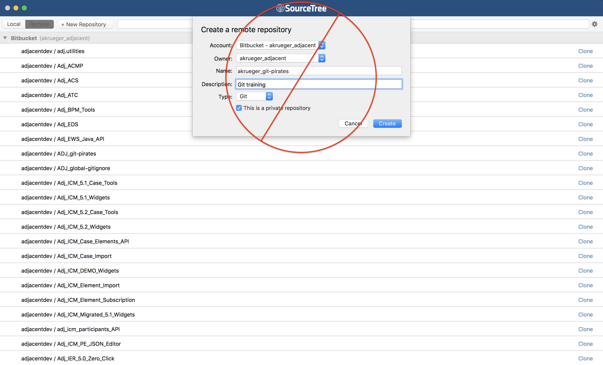

### **1) ACTION: Create a new repository on Bitbucket Cloud**
#### Open your profile at [Bitbucket Cloud](https://bitbucket.org/)
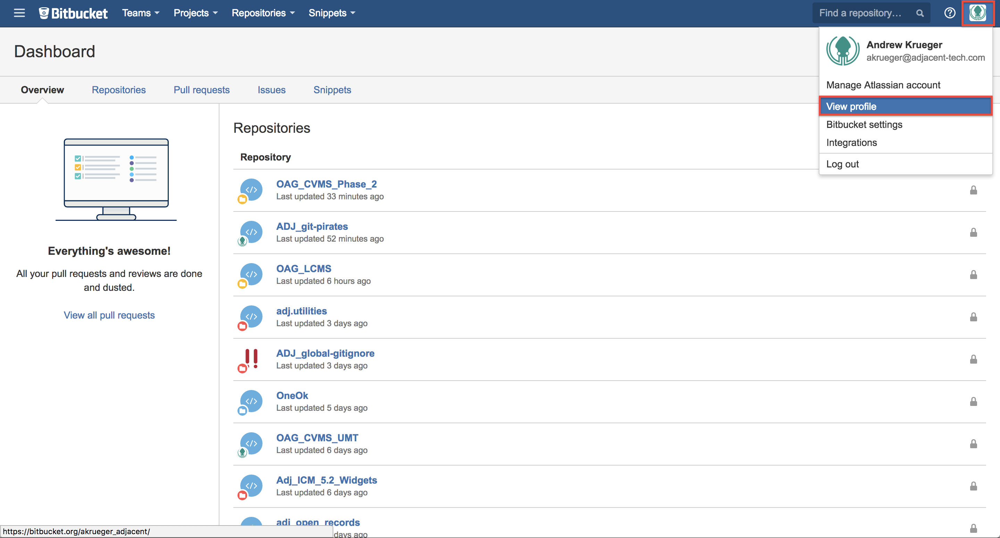

### Create a new repository
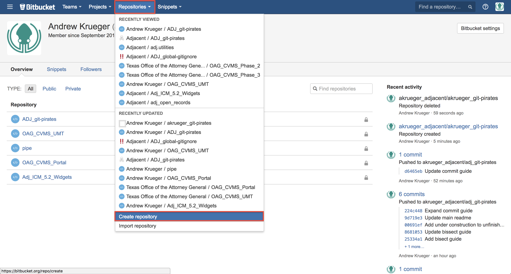

#### Ensure:
1. You are the owner
2. The repo is private
3. Only private forks allowed  
_*These ought to be the defaults, so just make sure they are correct_

#### Create the repository

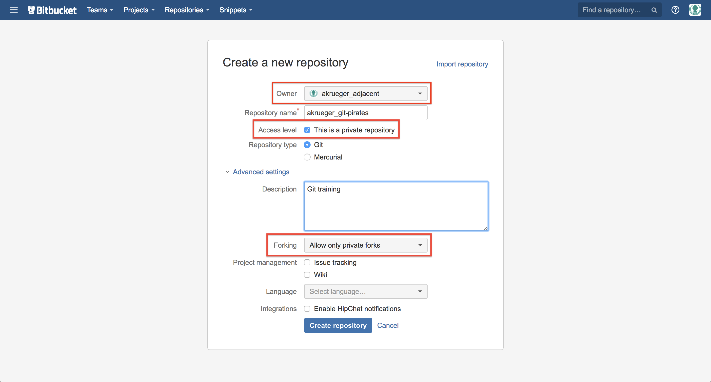

### **2) ACTION: Set the transfer protocol to HTTPS and copy the repository location**
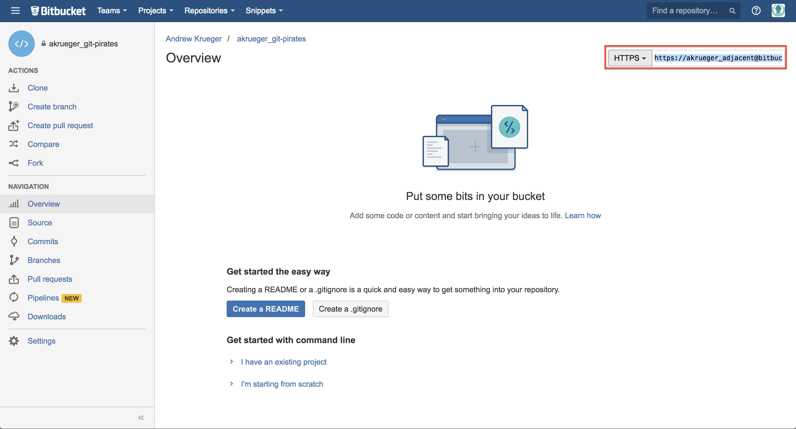

### **3) ACTION: Back in SourceTree, add a remote repository**
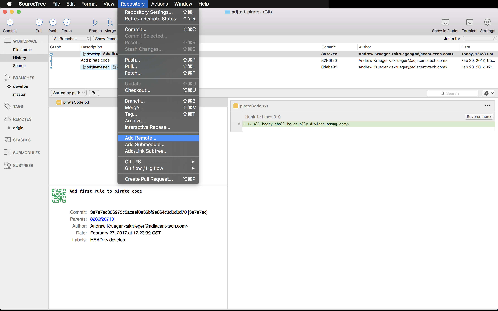

### **4) ACTION: Click on the Earth icon to search from hosted projects**
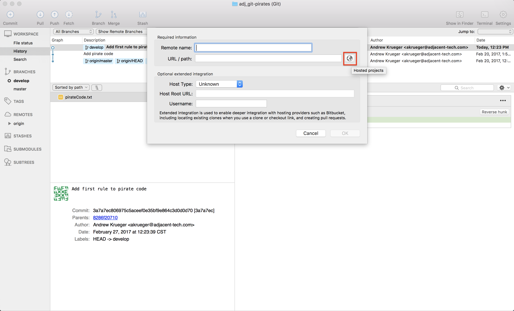

### **5) ACTION: Find the repository you just created on Bitbucket Cloud**
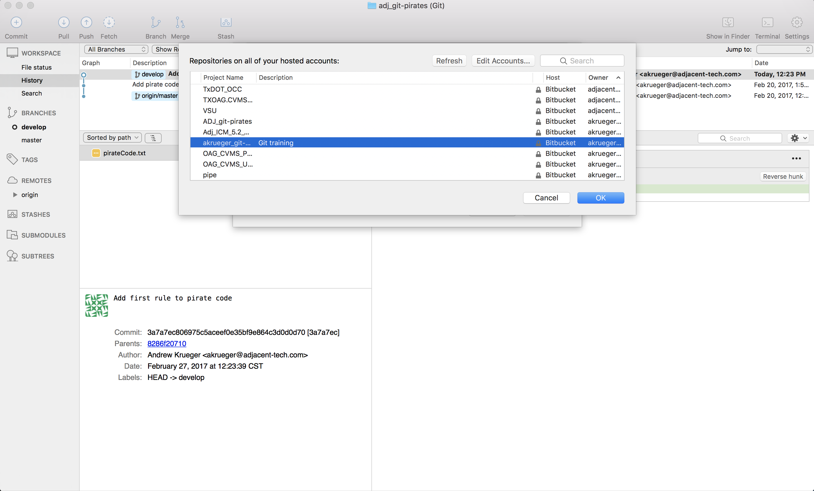

### **6) ACTION: Submit remote details**
#### SourceTree will populate everything but the name. You may call the remote anything you want, but I would recommend prefixing the repository with your username.

1. Name the remote
2. Enter the remote location
3. Enter Bitbucket information

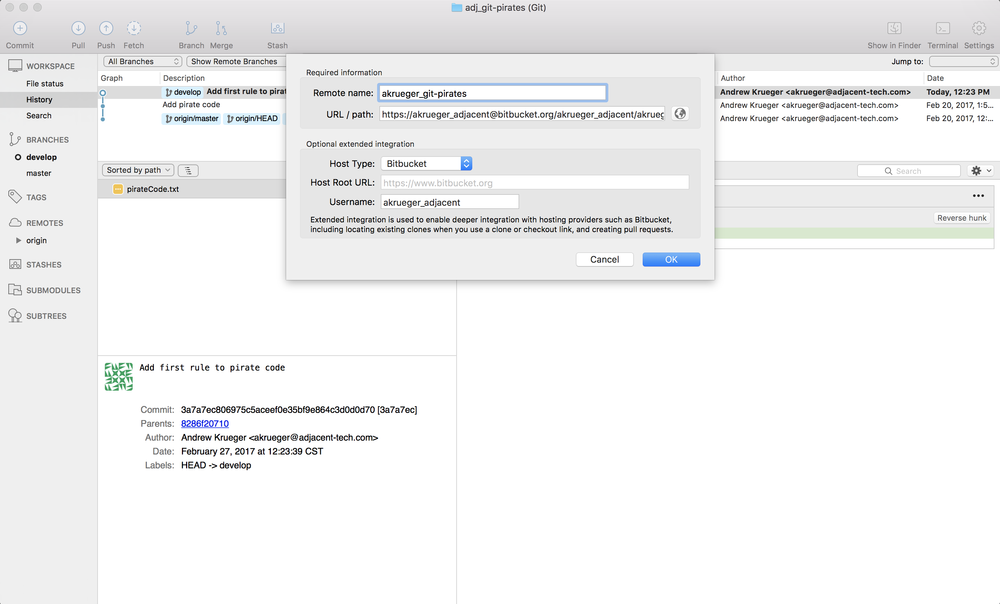

### **7) ACTION: Confirm the remote**
#### You should now see your new remote repository among all all remotes. Clicking OK will add it.  
_*Note: origin is the default name given to a repository when it is created--in this case origin refers to the `adj_git-pirates` remote on Bitbucket Cloud_
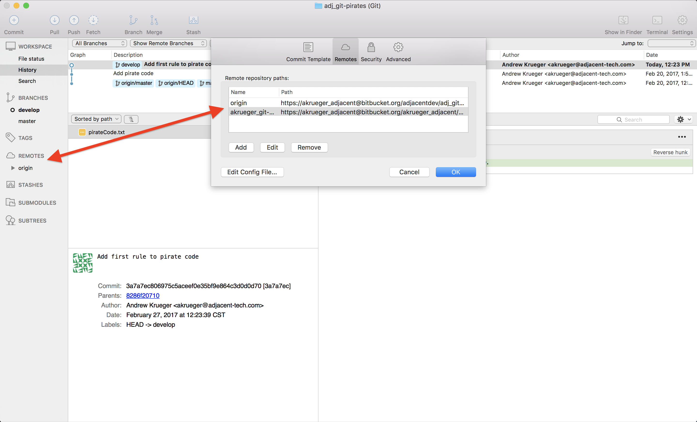

#### The remote has been added.
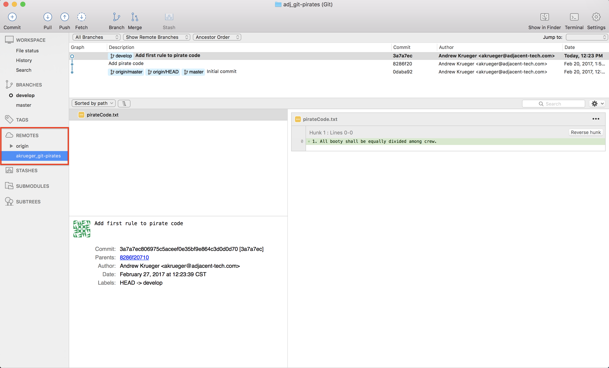

### **8) ACTION: Push to the remote repository**
#### We can now push our local repository's commits to our new remote by right clicking the remote and selecting `Push`
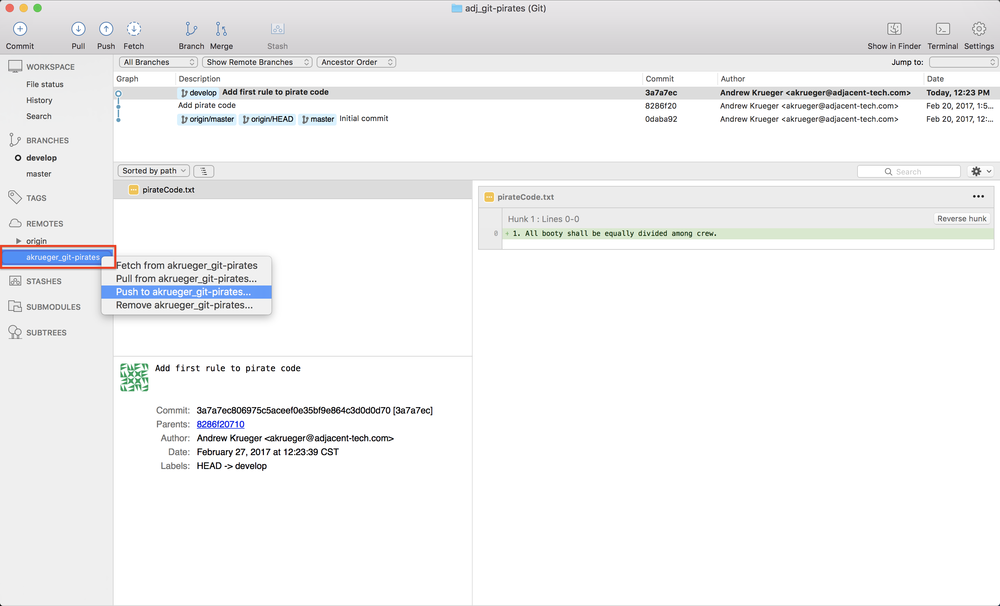

### **9) ACTION: Confirm push**
#### We haven't added any commits to `master` and we're just looking to backup our source, so we'll just push our `develop` branch for now.
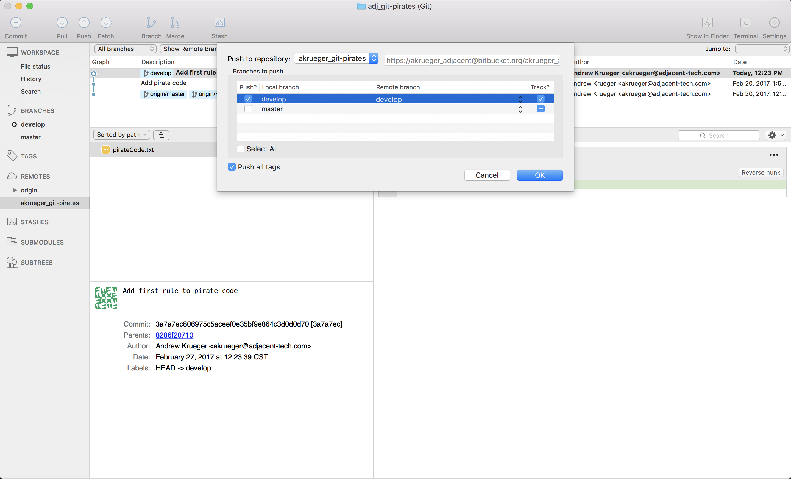

#### SourceTree will start pushing your committed snapshots on the `develop` branch to Bitbucket Cloud
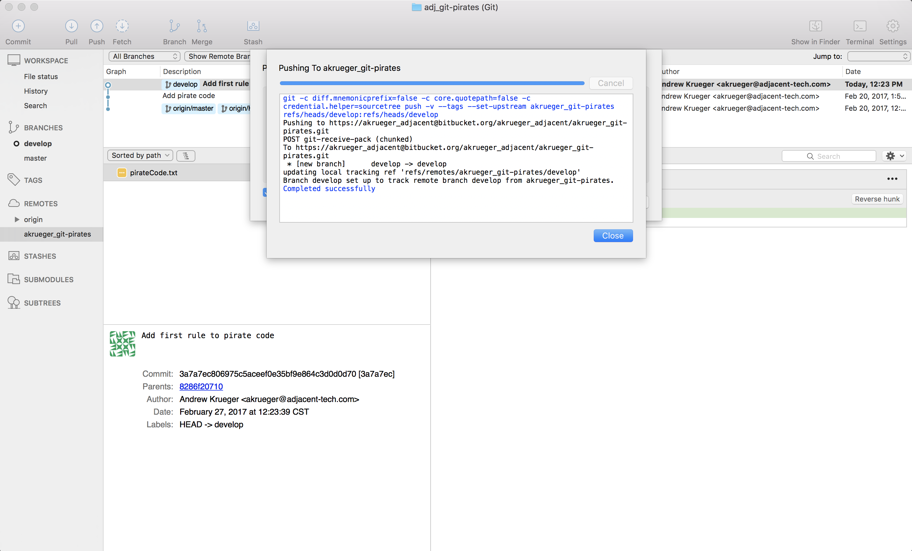

#### View remote details
#### Once it's finished, you should now see the `develop` branch under your remote and the state of all your local and remote repository/branch combinations.
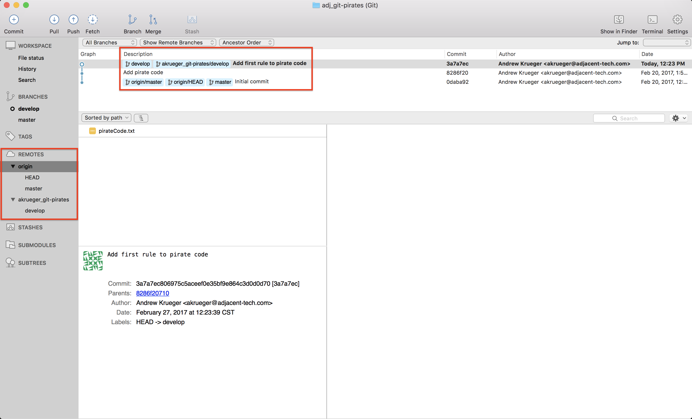

### The CLI equivalent:
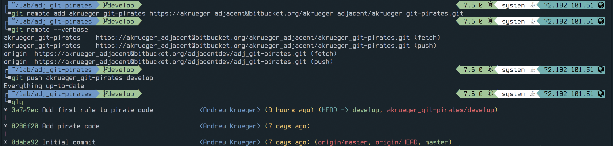

#### If we go back to Bitbucket Cloud we can see our commits are now present there.
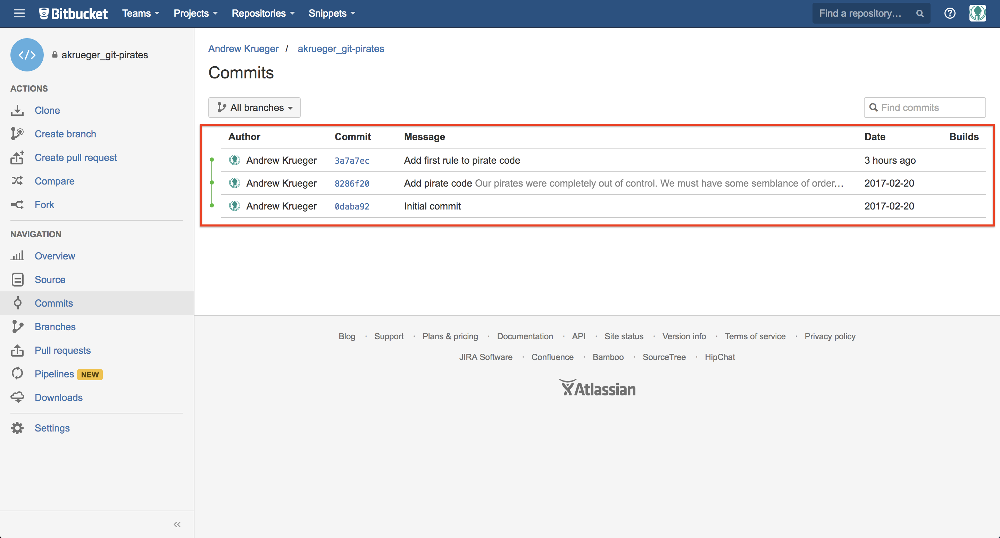
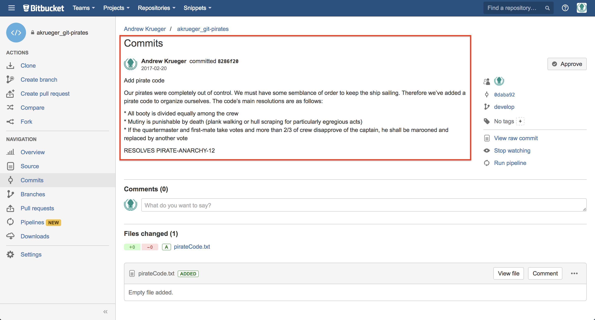

## **Next: [Ignores](https://bitbucket.org/adjacentdev/adj_git-pirates/wiki/Ignores)**  

## **[Home](https://bitbucket.org/adjacentdev/adj_git-pirates/wiki/Home)**